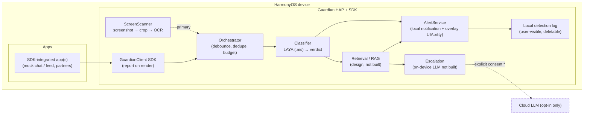

# Guardian — an on-device safety copilot for HarmonyOS

> **Status:** implemented and exercised on the HarmonyOS emulator. The primary
> as-built path is a **camera-anchored Smart Island** doing a **screen-region scan**
> (capture → crop → PP-OCRv4 → **LAY A** → incident). A second, demo path
> (**SDK trigger** from an integrated app) also exists and is covered by tests.
> See **§17 As-built** for the code map; §16 is design-only.
> **Date:** 2026-10-04
> **Target platform:** **HarmonyOS** (Huawei), native **ArkTS / ArkUI**
> **API level:** minimum **API 20** (`compatibleSdkVersion 6.0.0(20)`); the build
> compiles against the DevEco **HarmonyOS** SDK (`6.1.1(24)`) and runs on the
> HarmonyOS phone emulator.
> **Challenge areas:** *Human-Centric Technology* (accessible, wellbeing-focused
> guidance) + *Intelligent Experiences* (on-device AI).
>
> **As-built detection is LAY A-only.** Both the verdict and the incident come from
> the fine-tuned on-device model; there is **no deterministic/rules classifier and
> no embedding/RAG retrieval wired into the product**. Sections that describe those
> (§6/§8/§9) are marked where they are design-only or legacy. The model, its
> fine-tune and calibration are in `AI_INTEGRATION.md` / `DATA_SCIENCE.md`.
> **North star (§16):** true first-level (system) access (accessibility /
> notification triggers), reachable only with system signing.

---

## 1. Overview

Guardian is an **on-device safety copilot**. It acquires text through the triggers
that are viable for a normal HarmonyOS app, runs **local inference** to classify
it, and warns the user about **scams and misleading content** before they act.

**Triggers (HarmonyOS, third-party app):**

1. **Screen-region scan (as built, primary).** The user taps the island's **Select
   area** and drags a box over on-screen text; Guardian captures the screen
   (`screenshot.capture()`), crops to the box, OCRs it on-device and classifies it.
   This reads other apps **without their cooperation** — the closest a third-party
   app gets to system-level access — and runs on the emulator (CPU).
2. **In-app SDK (as built, demo path).** An integrated app reports text on render
   via `GuardianClient`; Guardian classifies on-device and posts a local
   notification. No OS permission; requires host-app cooperation.
3. **Alert surface — the floating island** (+ a local notification on the SDK path).
   Notifications are the *output*, not a trigger (see §10).
4. **Not built:** continuous `AVScreenCapture`, user-initiated share/clipboard, and
   the system-access triggers (§16).

**North star (§16):** with **first-level system access** (system signing),
Guardian would read the active window's text tree (accessibility) and receive
message notifications directly — the "react whenever a message is rendered in any
app" vision. Not reachable by a third-party HarmonyOS app today.

- **One engine** — scam/phishing and misinformation share a single
  acquire → classify → explain → warn pipeline.
- **On-device by default** — no content leaves the phone unless the user
  explicitly consents to a cloud escalation for a specific incident.
- **Advisory only** — Guardian never takes actions (no auto-pay, no auto-close,
  no auto-reply). It informs and suggests.

### One-line description

> An on-device safety copilot that checks the on-screen text you point it at —
> screen-region OCR plus a fine-tuned local classifier — warns about scams and
> misleading content before you act, and runs offline with an optional,
> user-enabled cloud "Describe".

---

## 2. Personas & user stories (refined)

### Persona A — the target scam victim ("Dana", elderly, low digital literacy)

1. Dana opens an **SDK-integrated** chat app. A new message from an unknown number
   claims to be her child: a car accident, a destroyed phone, an urgent transfer,
   and threats of legal consequences.
2. As the message is rendered, the app calls `GuardianClient.report(...)`, so
   Guardian analyzes the text before Dana can act.
3. Guardian posts a **local notification** ("Potential scam detected") and
   vibrates. *(On HarmonyOS with Live View support — device stretch — this could
   be a Smart Island capsule instead.)*
4. Dana taps it. Guardian's overlay screen opens, **replaying the message with
   the suspicious phrases highlighted**, explaining *how the scam works*
   (impersonation + urgency + untraceable payment), and suggesting a concrete
   action: **call your child on their known number**.
5. Dana calls her child and avoids the scam.

### Persona B — the social-media user ("Sam")

1. Sam **opts in** to feed/misinformation scanning for the browser/feed app
   (also SDK-integrated).
2. Sam scrolls a feed. A post claims a fabricated, alarming world event.
3. Guardian detects a low-credibility, high-emotion claim and posts an alert.
4. Sam taps it. The overlay summarizes *why* it looks unreliable and links to
   reputable sources, with an "ask Guardian to explain more" action.

### Scenario classification (UX levels)

| Verdict | Meaning | Response |
| --- | --- | --- |
| **CRITICAL** | High-confidence scam / active harm (money, credentials, coercion) | Immediate: high-priority notification + vibration (+ Live View capsule on supported devices). Opens the full overlay on tap. |
| **DANGEROUS** | Suspicious or misleading, lower confidence (e.g. fake news) | Quieter alert, app-scoped; visible in the detection log. |
| **SAFE** | No concern | Nothing shown (optional local log entry). |

---

## 3. Goals & non-goals

### Goals

- Detect **scam/phishing** and **misinformation** from message text, on-device.
- Detect **without target-app cooperation** via an on-device **screen-region
  scan** (capture → OCR → LAY A): the user selects the text to check. An **in-app
  SDK** path (a host app reports text it rendered) is also available.
- Keep **content private**: local inference by default, explicit consent for any
  cloud use.
- Give **actionable, explainable** guidance, not just a label.
- Be **accessible** (large text, screen-reader friendly, simple language) for the
  primary elderly persona.
- Run on a **HarmonyOS emulator or device** (CPU baseline; NPU on device) as the
  reproducible target.
- Keep a **clean seam** (`IngestSource`) so additional triggers (e.g. the
  system-access sources in §16) can be added without changing the engine.

### Non-goals (shipping build)

- **No third-party system access.** We do **not** assume system-app signing,
  the accessibility extension, or restricted permissions in the shipping build.
- **No silent screen reading.** The screen is read only on an explicit,
  user-consented capture (the screen-region scan).
- **A floating window, with an ACL.** The shipping UI is a `TYPE_FLOAT` window
  (`ohos.permission.SYSTEM_FLOAT_WINDOW`, `system_basic`), which requires it to be
  listed in the signing profile's `acls.allowed-acls` (§12). No *other* restricted
  permissions are used (no accessibility extension, no `SUBSCRIBE_NOTIFICATION`, no
  `CAPTURE_SCREEN`).
- No auto-remediation (blocking, paying, replying, closing apps).
- General-purpose malware/URL reputation scanning is out of scope for v1.
- Non-text content (images/video) beyond the OCR path.

---

## 4. Requirements & prerequisites

Everything required to build, sign, run, and demo the **shipping** design. Missing
optional pieces degrade honestly (a source is disabled and logged) instead of
blocking the build.

### 4.1 Build toolchain

| Requirement | Value / note |
| --- | --- |
| Language / UI | ArkTS / ArkUI, stage model |
| Min API | **API 20** (`compatibleSdkVersion 6.0.0(20)`); the dev/CI build compiles against the DevEco **HarmonyOS** SDK (`6.1.1(24)`) |
| IDE / SDK | DevEco Studio with the **HarmonyOS** SDK; built with `hvigorw` and installed with `hdc` on the HarmonyOS phone emulator |
| JDK | 17 (required for API 20+) |
| Node.js | ≥ 20 (Hvigor build tooling) |
| Build | `hvigorw` (DevEco) |

### 4.2 Signing & accounts (HarmonyOS)

| Requirement | Value / note |
| --- | --- |
| Debug signing | DevEco Studio **automatic signing**: a Huawei developer account with App/AppGallery admin role, the `bundleName` registered in **AppGallery Connect (AGC)**, and a connected device/emulator |
| Release signing (later) | AGC **release certificate + Profile** (`.cer` / `.p7b`), manual signing in DevEco |
| System / restricted signing | **No system-app signing**, but an **ACL** is required for `ohos.permission.SYSTEM_FLOAT_WINDOW` (`system_basic`): the island's `TYPE_FLOAT` window is listed in the signing profile's `acls.allowed-acls`. DevEco adds it to the debug profile; a store release needs a Huawei-approved profile (see §12) |

> The core flows use only normal / user-granted permissions, but the floating island
> needs `SYSTEM_FLOAT_WINDOW` (`system_basic`), so the signing profile must carry an
> ACL for it. No **system-app** signing (APL `system_basic` / `ohos_system_app`) is
> assumed; the system-access variant remains out of scope (§16).

### 4.3 Runtime & device prerequisites

| Requirement | Value / note |
| --- | --- |
| Target | HarmonyOS emulator (DevEco) or a real HarmonyOS device |
| Notifications | The user must **allow notifications** for Guardian (otherwise the alert cannot be shown) |
| On-device inference | `@kit.MindSporeLiteKit` runtime available (bundled with the OS SDK) |
| Network | Not required for the core flow (offline-first); needed only for opt-in cloud escalation |

### 4.4 Assets & models

| Asset | Purpose |
| --- | --- |
| **LAYA** classifier converted to MindSpore Lite (`*.ms`), shipped in `resources/rawfile` | Verdict classification (§8) |
| Small sentence-embedder (`*.ms`) — **design, not built** | KB retrieval / RAG (§9) |
| Curated **KB corpus** (scam patterns, misinformation heuristics, remediation templates) | Explanation + suggested actions (§9) |

### 4.5 Screen capture → OCR prerequisites (the as-built capture path)

| Requirement | Value / note |
| --- | --- |
| Target hardware | **Real HarmonyOS device** — `AVScreenCapture` screen recording is **not supported on the emulator** |
| Full-screen still capture | `screenshot.capture()` returns a **full-screen** screenshot; third-party access via `ohos.permission.CUSTOM_SCREEN_CAPTURE` (`normal`, `user_grant`, API 14), requested **from a foreground window** |
| Continuous capture | `AVScreenCapture` plus a **continuous task** (`ohos.permission.KEEP_BACKGROUND_RUNNING` + `backgroundModes`) so the session isn't suspended; the system shows a consent dialog + persistent capture indicator |
| On-screen trigger | Capturing while another app is foreground needs a persistent trigger (e.g. a global floating ball) or a notification action to briefly bring Guardian forward |
| OCR model | OCR model converted to `.ms` (on-device); accelerate with the NPU when present |

### 4.6 Explicitly excluded prerequisites

No system-app signing (APL `system_basic` / `ohos_system_app`), no
`ohos.permission.WRITE_ACCESSIBILITY_CONFIG`, no
`ohos.permission.ACCESSIBILITY_EXTENSION_ABILITY`, no
`ohos.permission.SUBSCRIBE_NOTIFICATION`; no AGC restricted-permission approval
beyond the `SYSTEM_FLOAT_WINDOW` ACL (§12). These system-access capabilities belong
to the intended design (§16) and are not needed to ship.

---

## 5. Platform feasibility & constraints (HarmonyOS, third-party app)

Verified against the SDK (`~/setup-ohos-sdk/linux/23`, API 23),
`toolchains/lib/PermissionDefinitions.json`, and Huawei docs. These constraints
drive the shipping architecture.

| Capability | API | Viable? | Notes |
| --- | --- | --- | --- |
| **A1 — in-app text ingress** | our `GuardianClient` (HAR) called by the host app on render | ✅ **Yes** — no OS permission | Host owns the text and reports it. Full message text, highest fidelity. **Implemented** as a common-event report (`com.hackyeah.guardian.MESSAGE_RENDERED`). **Demo path.** |
| **Local notification + vibration** | `@ohos.notificationManager` | ✅ Yes | The **alert surface** (SDK-driven). User must allow notifications. |
| **Screen capture → OCR (as built, primary)** | `@ohos.screenshot.capture()` (full screen, `CUSTOM_SCREEN_CAPTURE`), `AVScreenCapture` (continuous) | ✅ Yes (with consent) | `CUSTOM_SCREEN_CAPTURE` = `normal` / `user_grant` (API 14), requested from a foreground window. The continuous `AVScreenCapture` path is **not built** and is **real-device only** (no emulator). `CAPTURE_SCREEN` is system-only. |
| Manual "scan this" | `ShareExtensionAbility`, foreground `pasteboard` | ✅ Yes | User-initiated, privacy-clean. Optional. |
| On-device inference | `@kit.MindSporeLiteKit` / `@ohos.ai.mindSporeLite` | ✅ Yes | CPU on emulator; `NNRTDeviceType.ACCELERATOR` → NPU on device. |
| Remote push (Push Kit) | HMS **Push Kit** | ✅ Yes (AGC + Push capability) | Server-originated; needs network + AGC + token. **Not a trigger** for us — see §10. |
| Smart Island / Live View | HMS **Live View Kit** | ⚠️ Unverified (device/AGC-bound) | Documented **stretch** alert surface. |
| **Notification listening** (read others' notifications) | `NotificationSubscriberExtensionAbility` | ❌ **No** (for third-party) | Requires `ohos.permission.SUBSCRIBE_NOTIFICATION` = `system_basic` / provision-gated (documented for wearable/companion apps). |
| **Accessibility text-render** (any app's UI) | `AccessibilityExtensionAbility` | ❌ **No** (for third-party) | `onAccessibilityEvent/onKeyEvent` `@deprecated since API 12`; capability closed. |
| **System-app status** | APL `system_basic` / `ohos_system_app` | ❌ **No** (for third-party) | Reserved for Huawei-signed system apps. |
| **Draw a window over other apps** | `window.TYPE_FLOAT` | ⚠️ **Yes, with ACL** | Requires `ohos.permission.SYSTEM_FLOAT_WINDOW` (`system_basic`); must be listed in the signing profile's `acls.allowed-acls`. Used by the shipping island and region selector. |
| `@ohos.data.intelligence` | system on-device AI (API 15+) | ⚠️ Device-dependent | We bundle our own `.ms` models instead, so behaviour is identical everywhere. |

**Design consequences**

1. Guardian is a **normal HarmonyOS HAP plus a reusable SDK** — not a system or
   accessibility service. The detection engine is fed by an `IngestSource`
   abstraction: `InAppSdkSource` (SDK path) and the screen scanner + region
   selector (`vision/ScreenScanner`, `alert/SelectorOverlay`, `pages/SelectArea`).
2. The **screen-region scan** reads other apps on the emulator without their
   cooperation — the closest a third-party app gets to system access. The **SDK
   path** needs a target app to call the SDK but is higher-fidelity and adds no OS
   permission.
3. Alerts are delivered as **local notifications** + an in-app overlay; the
   literal "Smart Island over the chat app" UX is out of scope (Live View adapter
   is a documented device stretch).
4. The engine is **trigger-agnostic**, so additional triggers (e.g. the
   system-access sources in §16) plug in behind the same `IngestSource` interface.

---

## 6. Architecture



Components:

- **`GuardianClient` SDK** (`@hackyeah/guardian_sdk`, HAR) — the host app links it
  and, on rendering a message, calls
  `report({ bundleName, text, messageId?, timestampMs? })`. The report is
  serialized by `GuardianProtocol` and published as a **common event**
  (`GUARDIAN_MESSAGE_EVENT`); the SDK never reads anything the host did not hand
  it. *Design evolution:* an earlier draft used a bound `ServiceExtensionAbility`
  / typed-`Want` delivery; the common event is the simpler, permission-free
  Phase-1 mechanism, and the wire format is versioned so a service transport can
  replace it without touching the engine.
- **`ScreenScanner` + region selector (screen path)** — user-consented `screenshot.capture()` /
  `AVScreenCapture` → on-device OCR → text. Same pipeline downstream.
- **`InAppSdkSource`** — subscribes to the SDK event, `decodeReport`s
  the payload, and emits a `ScanJob` to the engine.
- **Orchestrator / ingestion** — `IngestSource` turns ingress into *scan jobs*;
  `TriggerEngine` applies the scan policy (unchanged-text skip, a short dedupe
  window, a max-scans/min budget — `ScanPolicy`) and calls the classifier.
  Per-app user toggles are designed but not yet built.
- **Content normalization** — produces a normalized string (capped ≈2,000 chars)
  with source metadata (bundle, source, timestamp).
- **Classifier (as built)** — **LAY A** (fine-tuned, MindSpore Lite `.ms`) answers two
  baked questions in one forward pass: a `deception` gate (the verdict) and an
  `incident` choice over the KB ids (which case to show). See `vision/LayaClassifier`.
  `trigger/Classify.ts` is a **legacy deterministic stub, exercised only by the
  ohosTest suite; it is not used in production.**
- **Retrieval (RAG) — not built.** The embedding model + cosine retrieval in §9 are
  design only; the app ships a static incident KB and lets LAY A pick the case.
- **Escalation — partially built.** The optional **DeepSeek "Describe"** action is the
  only implemented escalation; the on-device-LLM → cloud-LLM chain (§9) is design.
- **AlertService** — the `TriggerAlertSink` seam; the shipping implementation
  (`NotificationService`) posts the **local notification**. The overlay
  `UIAbility` is designed, not yet built.
- **Detection log** — optional, local, redacted, user-viewable and deletable.

### Data flow (single scan)

```
ingress (SDK report | screenshot-OCR) → debounce/dedupe
      → normalize → LAY A classify → verdict + incident id
      → incident KB lookup → island card / Details (| optional DeepSeek "Describe")
```

---

## 7. Content acquisition & triggers

Ingestion is defined by one interface — `IngestSource` — so the engine is
decoupled from *how* text arrives and the system-access triggers (§16) can be
added later.

```ts
// As implemented (platform-free; see trigger/IngestSource.ts):
interface ScanJob {
  bundleName: string;
  text: string;
  messageId?: string;
  timestampMs: number;
}

interface IngestSource {
  name: string;                     // 'sdk' now; 'screen-ocr' | 'accessibility' | 'notification' later
  enabled(): boolean;               // permission + user toggle
  start(emit: (job: ScanJob) => void): void;
  stop(): void;
}

// Where non-SAFE verdicts go (implemented by NotificationService):
interface TriggerAlertSink {
  alert(result: ScanResult, sourceText: string, source: TriggerSource): void;
}
```

### 7.1 In-app SDK trigger (demo path — implemented)

The host app links `GuardianClient` (`@hackyeah/guardian_sdk`) and calls it
whenever it **renders message text** (and optionally on a suspicious action):

```ts
import { GuardianClient } from '@hackyeah/guardian_sdk';
client.report({ bundleName: 'com.hackyeah.mockchat', text: msg.text, messageId: '3', timestampMs: Date.now() });
```

`GuardianProtocol.encodeReport` serializes the report and `GuardianClient`
publishes it on the **`com.hackyeah.guardian.MESSAGE_RENDERED`** common event.
Guardian's `InAppSdkSource` subscribes, `decodeReport`s the payload (JSON, with a
plain-text fallback for legacy publishers; malformed/empty reports are dropped)
and emits a `ScanJob` to the engine. No OS permission and no hidden screen read
are involved: the host only reports text it already owns.

- **As built:** `report()` is fire-and-forget; Guardian alerts on
  `DANGEROUS`/`CRITICAL` through `TriggerAlertSink` (`NotificationService`). A
  **synchronous inline-verdict** API is designed but not yet exposed.
- **Designed, not yet built:** per-app **user toggle**.
- Because the host is the source, this is the **highest-fidelity, fully-open**
  path and the one the demo/mock apps use.

### 7.2 Screen capture → OCR (the as-built primary path)

`vision/ScreenScanner` reads the screen **without target-app cooperation**:

- **Trigger:** the user taps **Select area** on the island and drags a box
  (`alert/SelectorOverlay` + `pages/SelectArea`); Guardian then captures.
- **Capture:** `screenshot.capture()` returns a **full-screen** image; the app holds
  `CUSTOM_SCREEN_CAPTURE` (requested from a foreground window). The island is hidden
  from the capture (`setWindowPrivacyMode`).
- **Process:** `PixelMap.crop` to the selected box (vp → px via `densityPixels`), then
  on-device OCR on the crop; the captured frame is released right after.
- **Continuous / other-app triggering (not built):** would need `AVScreenCapture` +
  a continuous task (real device only) or a system source (§16).

**As built (OCR engine).** `extractTextFromImage(pixelMap, mgr)` in
`entry/src/main/ets/ocr/OcrEngine.ets` runs **PP-OCRv4 mobile** detection and
recognition converted to MindSpore Lite: `det` (`1×960×960`, DB) finds text quads
(`DbPostprocess.ts`: components → min-area rect → rect-expansion unclip), `rec`
(`1×48×960`, SVTR/CTC) reads each crop (`ImageOps.ts`), and `CtcDecode.ts` maps the
`ppocr_keys_v1` dictionary. Models ship in `resources/rawfile/ocr/`. The engine is
wrapped by `vision/ScreenScanner` (capture → crop → OCR → `LayaClassifier` → KB).

### 7.3 Optional — user-initiated share / clipboard

A `ShareExtensionAbility` target (and a foreground clipboard read) let the user
explicitly send a suspicious message to Guardian. Privacy-clean and permission-free
when user-initiated.

### 7.4 Scan policy (applies to all sources)

- **Event-driven, never continuous.**
- **Debounce/dedupe** so a transcript is classified once, not per
  keystroke/message-fragment. **As built** (`ScanPolicy`): a hard skip when the
  text is unchanged, plus a short dedupe window, plus a rolling **max-scans/min**
  budget (clock-injectable).
- **Privacy/energy budget**: designed additions are per-app gating and a
  cooldown; the max-scan rate + unchanged-skip are implemented.

**Why both paths exist.** The **screen-region scan** is the as-built primary: it
reads other apps on the emulator without their cooperation. The **SDK path** is a
higher-fidelity demo (the host hands over full message text) but needs a target app
to integrate; the system-access triggers in §16 would remove even that.

---

## 8. Detection model

- **Model:** **LAYA** (`convaiinnovations/laya`) — a small, *non-autoregressive
  decision/routing* model (see Appendix A). It is a classifier, **not** a
  generative LLM: it can output a decision/label and score, but it cannot write
  advice.
- **Label space:** `SAFE | DANGEROUS | CRITICAL`, plus a **category**
  (`scam`, `phishing`, `misinformation`, `harassment`, `none`) and a confidence.
- **Integration:** LAYA is converted to MindSpore Lite `.ms` and run via
  `@ohos.ai.mindSporeLite` on `NNRTDeviceType.CPU` (emulator) or `ACCELERATOR`
  (NPU on device).
- **Confidence → verdict mapping** (configurable):
  - `CRITICAL`: high-confidence harm with urgency/financial/credential demand.
  - `DANGEROUS`: suspicious or misleading, or CRITICAL category at lower
    confidence.
  - `SAFE`: below the alert threshold.
- **As built:** the classifier shipped today is the **fine-tuned LAY A** model on
  MindSpore Lite. It answers the `deception` gate and the `incident` choice in one
  forward pass (deception ROC-AUC 0.930, gate 0.25; incident macro-F1 ≈ 0.33,
  display-only). Model, data and calibration are in `AI_INTEGRATION.md` /
  `DATA_SCIENCE.md`.
- **No rules fallback.** There is deliberately no deterministic/heuristic fallback in
  the product: a rule-based guess risks a false positive, which for a safety alert is
  worse than showing nothing. If the `.ms` is missing or fails to load, the UI reports
  that the on-device model is unavailable (`trigger/Classify.ts` is a legacy stub used
  only by the ohosTest suite).

---

## 9. Knowledge base, embeddings & RAG

**Purpose:** explain *what* is happening and *what to do*, grounded in curated
knowledge, with an escape hatch when the KB is insufficient.

> **As built:** the shipped incident knowledge base + LAY A's `incident` choice
> (§18). **The embedding model and RAG below are not built** — they are the
> longer-term retrieval design, kept for context.

- **KB corpus (curated, shipped offline):**
  - Scam patterns: authority/relative impersonation, urgency, isolation, unusual
    payment rails (gift cards, crypto, wire), credential/link lures.
  - Misinformation heuristics: unverified claims, emotional manipulation,
    missing sourcing, known hoaxes.
  - **Remediation templates** per category (plain language, accessibility-first).
- **Embedding model (design, not built):** a small sentence embedder (e.g.
  `all-MiniLM-L6-v2` or `BGE-small-en-v1.5`, ~384-dim) converted to **`.ms`** and run
  on-device.
- **Retrieval (design, not built):** cosine similarity top-k over KB entries.
- **"System triggers" (escalation rules encoded alongside KB entries):**
  1. **KB hit above threshold** → answer from the KB (fast, deterministic,
     cacheable).
  2. **No confident hit, or CRITICAL with low confidence** → **on-device LLM**
     composes a short, constrained remediation.
  3. **Still unresolved and the user consents** → **cloud LLM** for that single
     incident, with redacted text.

**Escalation chain (design; only the DeepSeek step is built):** `KB → on-device LLM → cloud LLM (explicit consent)`.

- **On-device LLM (device path):** a quantized small model (e.g. Qwen2.5
  0.5B–1.5B `.ms`) via the MindSpore Lite LLM module; NPU on device, CPU on the
  emulator (slow → optional/off by default there).
- **Cloud (opt-in only):** never automatic. A per-incident consent sheet states
  exactly what text would be sent. Default: **off**.

---

## 10. Response & alert UX

**`AlertSurface` abstraction** so the delivery channel is swappable — implemented
as the `TriggerAlertSink` interface (`NotificationService` is the shipping sink):

| Surface | Availability | Role |
| --- | --- | --- |
| **Local notification (+ vibration)** | HarmonyOS (third-party) | **Primary surface.** A detection (screen scan, or an SDK report) posts a notification; tapping opens the overlay. User must allow notifications. |
| **In-app overlay screen (`UIAbility`)** | HarmonyOS | Replays the flagged text **highlighted**, explains the scam/claim, and offers actions (*Call your child*, *See reliable sources*, *Dismiss*, *Report mis-detection*). |
| **Smart Island / Live View adapter** | HarmonyOS device (HMS Live View Kit), unverified | Documented **stretch**. Same `AlertSurface`, so the pipeline is unchanged. |

**Notifications are the output, not a trigger.** Two notification mechanisms are
worth distinguishing:

- **Local notification (used):** the app composes and posts the alert itself via
  `@ohos.notificationManager.publish()` — on-device, offline, no server. This is
  what "SDK-driven notification" means: a **local** alert raised by our own
  detection pipeline (fed by the screen scan or an SDK report).
- **Push Kit remote push (not used):** a backend → Huawei Push servers → device.
  It requires AGC + Push capability + a token and network, and cannot read local
  messages or other apps' notifications. It is not a trigger for Guardian; it is
  only relevant if a backend ever needs to wake the app.

**Accessibility of the alert:** large type, high contrast, plain-language summary,
screen-reader labels, and a "read aloud" action — matching the primary persona.

**Explainability:** every alert shows the matched incident's plain-language
*explanation* and next steps from the KB, rather than just a score. (`signals` is a
legacy field, empty on the as-built paths.)

---

## 11. Consent, privacy & security

### Consent model

- **A1 (SDK)** = two consents: the **host app** chooses to integrate and report
  (developer-side), and the **user** enables Guardian per app in-app. No OS-level
  screen permission is requested.
- **A3 (screen OCR)** = explicit **per-capture** consent via the system dialog;
  never background.
- **Notifications** = the user's OS-level "allow notifications" setting.
- **Global kill switch** and a persistent status indicator, showing the active
  ingress sources.
- **Cloud escalation** = separate, per-incident, explicit consent (default off).

### Data handling

- All classification/retrieval runs **on-device**.
- Messages are processed **in memory**; not persisted by default.
- The optional **detection log** stores redacted verdicts locally (user-viewable
  and deletable), never raw sensitive content by default.
- Cloud (if consented): send the **minimum** redacted text for one incident; no
  identifiers, no history.

### Threat model & guardrails

- **Sensitive content** is exactly what we ingest → offline-first, no
  exfiltration, transparent UI, no telemetry by default.
- **Prompt injection** from ingested text into the LLM: treat all message text as
  untrusted data; constrain the LLM to produce short remediation text only; never
  let it trigger actions.
- **False positives/negatives** are surfaced honestly; users can dismiss/correct;
  thresholds are tunable and logged.
- **Abuse/tampering**: a user can disable the feature (acceptable); we do not
  attempt persistence or privilege escalation.

---

## 12. Permissions & capabilities (minimum set)

| Permission / capability | Why | Build |
| --- | --- | --- |
| `ohos.permission.SYSTEM_FLOAT_WINDOW` (`system_basic`) | Camera-anchored floating island + region selector (`TYPE_FLOAT`) | Shipping (**requires ACL**) |
| `ohos.permission.CUSTOM_SCREEN_CAPTURE` (`normal`, `user_grant`) + system consent dialog | Screen capture → OCR (still capture) | Shipping |
| `ohos.permission.KEEP_BACKGROUND_RUNNING` (`normal`) + `backgroundModes` | Keep the capture/scan session alive | Shipping |
| Notification publish (`@ohos.notificationManager`, user-enabled) | Post the alert notification | Shipping |
| `ohos.permission.INTERNET` (`normal`, optional) | Dev "Remote GPU" backend and the user-enabled DeepSeek "Describe" action | Optional |

**One restricted permission.** The floating island needs
`ohos.permission.SYSTEM_FLOAT_WINDOW` (`system_basic`), so the build requires a
signing profile that declares it in `acls.allowed-acls` (DevEco can do this for a
debug profile; a store release needs a Huawei-approved profile). No accessibility
extension, no `SUBSCRIBE_NOTIFICATION`, no `CAPTURE_SCREEN`. The core product is
offline; `INTERNET` is present only for the optional dev/cloud paths and can be
removed for a strictly offline build. Absent capabilities degrade honestly.

---

## 13. Demo plan (reproducible on a HarmonyOS emulator)

The demo ships a **separate mock app** that integrates the SDK, so the cross-app,
"message rendered → Guardian reacts" path is real in principle:

- `com.hackyeah.mockchat` — a WeChat-like chat UI, preloaded with the
  "family emergency / wire money" scam thread. It links **`GuardianClient`** and
  calls `report(...)` as each message renders. **Built.**
- `com.example.huwaweichallenge` — the Guardian engine HAP: the camera-anchored
  Smart Island (region scan → OCR → LAY A → incident), the `InAppSdkSource`
  endpoint (subscribes to the SDK event), and the notification alert. **Built.**
- (The `facebook-feed-mock/` web feed used earlier to demo the screen scan was
  **removed** from the repo.)

**Script (screen scan, primary):** launch Guardian → tap **Guard** (the pill appears
under the camera) → open any app (e.g. the mock chat) → tap the pill → **Select area**
→ drag a box around the scam text → **Scan this area** → the island shows the matched
incident → **Details** opens the explanation and next steps.

**Script (SDK path):** launch Guardian (it subscribes to the SDK event) → allow
notifications → open the mock chat → as each message renders the SDK reports it →
Guardian classifies on-device → a local notification appears.

**Emulator caveat (verified).** An emulator may kill the backgrounded Guardian
process, so the live cross-app SDK path needs a real device or a persistent
background mechanism. The primary emulator demo is the **screen scan**
(Select area → crop → OCR → LAY A → incident); the SDK path is covered by the
unit + `ohosTest` suites.

**Automated evidence:** unit **31/31**; hypium `ohosTest` **3/3** (last run).
See §17 for the exact commands.

**Screen scan, no cooperation:** the user selects a region and Guardian captures the
screen (`screenshot.capture()`), crops to the box, OCRs it on-device, and raises the
alert. Continuous `AVScreenCapture` + a continuous task (real device only) is not
built.

**Evidence to capture:** build logs (`BUILD SUCCESSFUL`, JDK 17 for API 20+),
install/launch output, `hilog` of the pipeline
(`ingest → classify → verdict → retrieval`), screenshots of the notification and
overlay, and the detection JSON.

**Emulator caveats:** CPU-only (no NPU), HMS Live View unverified; notification
permission must be enabled in Settings. NPU/Live View are documented as
device/stretch paths.

---

## 14. Risks & open questions

| Risk | Impact | Mitigation |
| --- | --- | --- |
| **Coverage needs app adoption** — a third-party HarmonyOS app cannot auto-read other apps | High | Ship a clean SDK + docs; demo via mock apps; treat §16 system access as the north star |
| LAY A accuracy is domain-sensitive (trained on DIFrauD + synthetic UI; deployed on OCR'd screen text) | High | Head-only fine-tune + temperature/threshold calibration; honest limits in `DATA_SCIENCE.md`; deliberately no false-positive fallback |
| LAYA size (~322–421M params, ~1.1–1.4 GB F16) on a 4 GB emulator | Medium | Q4/Q8 quantization or a smaller model for the emulator baseline |
| **Continuous `AVScreenCapture` is not supported on the emulator** | Medium | Not built; the one-shot `screenshot.capture()` region scan is the emulator path |
| Background capture survival (continuous task may be killed / power-managed) | Medium | `KEEP_BACKGROUND_RUNNING` + `backgroundModes` + progress/heartbeat; test on a real device |
| Screen capture permission from background / triggering over other apps | Medium | Request `CUSTOM_SCREEN_CAPTURE` from the foreground; use a persistent on-screen trigger or a notification action |
| False positives erode trust | Medium | Tunable thresholds, clear explanations, dismiss/correct |
| Live View/Smart Island unverified | Medium | Notification-first; `AlertSurface` adapter as stretch |
| Language coverage (scams arrive in the user's language) | Medium | Scope v1 language explicitly; document expansion |
| Cloud privacy concerns | Medium | Off by default; per-incident consent; minimal redacted payload |

**Open questions:** final product name/bundle; v1 language(s); which embedding
model and on-device LLM; the fine-tuning dataset for LAYA; cloud provider.

---

## 15. Milestones

1. **M0 — Scaffolding:** ✅ Guardian HAP + `GuardianClient` SDK build and install;
   mock chat reports a message via the SDK. *(feed app not built)*
2. **M1 — Ingestion:** ✅ `IngestSource` interface; `InAppSdkSource` live;
   dedupe/budget (`ScanPolicy`). ☐ per-app gating, normalization.
3. **M2 — Classification:** ✅ fine-tuned LAY A `.ms` on CPU (+ NNRt when present);
   `deception` gate + `incident` choice behind `classify(text) → ScanResult`.
4. **M3 — KB:** ✅ curated incident KB + explanation; ☐ embedding/RAG retrieval (not built).
5. **M4 — UX:** SDK-driven local notification + overlay with highlighting and
   actions; accessibility polish.
6. **M5 — Escalation:** on-device LLM path; consent-gated cloud path.
7. **M6 — Demo & hardening:** mock-chat SDK demo, evidence
   capture, thresholds, docs, device/NPU and Live View stretch.
8. **M7 — Screen scan (partly done):** `ScreenScanner` + region selector using
   `screenshot.capture()` → crop → on-device OCR → LAY A. **Built.** Continuous
   `AVScreenCapture` + task (real device), throttling, and NPU acceleration remain.

---

## 16. Intended / final design — first-level (system) access

> **Status:** north star / not reachable by a third-party app in any phase. It is
> retained so the seam (`IngestSource`) exists and the roadmap is explicit.

**Concept.** "First-level system access" means the app is **signed as a system
app** (APL `system_basic` / `app-feature = ohos_system_app`), which unlocks
system-wide, automatic triggers that a normal app cannot have. With it, Guardian
would stop depending on host-app integration and simply react to whatever is on
screen / in the notification stream.

**What it enables (the full vision):**

1. **Accessibility text-render trigger** — read the active window's element tree
   in *any* app and react whenever a message is rendered:
   - `AccessibilityExtensionAbility` (`onAccessibilityEvent`) +
     `AccessibilityExtensionContext.getWindowRootElement()`, capability
     `retrieve`.
   - Programmatic enablement (no Settings dance) via the system-only
     `@ohos.accessibility.config.enableAbility('<bundle>/<ability>', ['retrieve'])`,
     permission `ohos.permission.WRITE_ACCESSIBILITY_CONFIG`.
2. **Notification trigger** — `NotificationSubscriberExtensionAbility.onReceiveMessage()`
   for apps that are not integrated, permission
   `ohos.permission.SUBSCRIBE_NOTIFICATION`.

Both plug into the existing engine as additional `IngestSource`s
(`accessibility`, `notification`) — the classifier, KB and alert UX are
unchanged.

**How the tier is reached:**

- **OpenHarmony / Oniro (reproducible today, dev only):** self-sign as a system
  app using the SDK material — `OpenHarmony.p12` (the SDK's built-in dev
  password),
  `OpenHarmonyProfileRelease.pem`, `UnsgnedReleasedProfileTemplate.json`,
  `hap-sign-tool.jar`; set `bundle-info.apl = system_basic` and
  `app-feature = ohos_system_app`, re-sign the Profile, then sign the HAP. This is
  documented and reproducible, but **debug/dev only** (not for AppGallery).
  *(The Oniro emulator's acceptance of raised-APL signing and the API-12
  deprecation of the accessibility callbacks are the open verification risks.)*
- **HarmonyOS (target platform):** the same first-level access exists but is
  reserved for **Huawei-signed system apps**; a third-party app cannot obtain it
  without Huawei system signing / approval. On HarmonyOS this section is therefore
  **aspirational** and is why the third-party design uses screen-region OCR plus an
  optional SDK path.

**Relationship to the as-built design.** One engine; the system build simply swaps
`InAppSdkSource` / `ScreenScanner` for `AccessibilitySource` +
`NotificationSource`. The third-party build is the honest, publishable subset;
system access is the full target.

**Ethics/consent.** Even with system access, the accessibility service is
user-enabled and visible; Guardian remains advisory-only and on-device by default.

---

## 17. As-built — what actually ships today

**Status:** implemented and exercised on the dev emulator. Two ingestion paths:

1. **Screen scan (primary UI).** A **camera-anchored Smart Island** (`alert/IslandOverlay`
   + `pages/FloatingIsland` + `components/SmartIsland`) sits just under the front-camera
   cutout. The user taps **Select area**, drags a box (`alert/SelectorOverlay` +
   `pages/SelectArea`), and Guardian captures the screen, **crops to the box**, runs
   on-device PP-OCRv4 and LAYA, and shows the matched incident (or opens
   `pages/IncidentDetail`). The island is hidden from the capture.
2. **In-app SDK trigger.** An integrated app (`mocks/mockchat`) reports rendered text via
   `GuardianClient`; `InAppSdkSource` → `TriggerEngine` → rules classifier →
   `NotificationService` (local notification only).

### Code map

| Area | Path |
| --- | --- |
| SDK HAR `@hackyeah/guardian_sdk` | `HuaweiChallenge/guardian_sdk/` |
| SDK client / wire contract | `guardian_sdk/src/main/ets/GuardianClient.ets`, `GuardianProtocol.ts` |
| Island window | `entry/src/main/ets/alert/IslandOverlay.ets`, `pages/FloatingIsland.ets` |
| Island UI | `entry/src/main/ets/components/SmartIsland.ets` |
| Region selector | `entry/src/main/ets/alert/SelectorOverlay.ets`, `pages/SelectArea.ets` |
| Incident page | `entry/src/main/ets/pages/IncidentDetail.ets`, `components/IncidentDetailView.ets`, `detail/DetailTypes.ts` |
| Scanner | `entry/src/main/ets/vision/ScreenScanner.ets` |
| OCR | `entry/src/main/ets/vision/OcrEngine.ets`, `ocr/OcrEngine.ets` (+ `ImageOps`, `DbPostprocess`, `CtcDecode`, `OcrTypes`) |
| LAYA classifier | `entry/src/main/ets/vision/LayaClassifier.ets` → `domain/usecase/AnalyseMessageUseCase.ets` |
| Incident KB | `entry/src/main/ets/alert/IncidentKb.ets`, `resources/rawfile/kb/en/incidents.json` (§18) |
| Theme | `entry/src/main/ets/alert/AlertTheme.ets` |
| SDK ingestion | `entry/src/main/ets/sdk/InAppSdkSource.ets`, `trigger/TriggerEngine.ets`, `trigger/ScanPolicy.ts`, `trigger/IngestSource.ts`, `trigger/TriggerTypes.ts` (`trigger/Classify.ts` is a legacy stub, test-only) |
| Alert sink | `entry/src/main/ets/alert/NotificationService.ets` |
| Dev-only remote backend | `entry/src/main/ets/dev/` (`BackendSettings`, `BackendFactory`, `RemoteClient`), `vision/RemoteOcrEngine.ets`, `data/datasource/RemoteDecisionRepository.ets` |
| Demos | `mocks/mockchat/` (SDK host app) |

### Wire format (SDK path)

- Event: `com.hackyeah.guardian.MESSAGE_RENDERED`
- Payload (`data`): `{"v":1,"bundleName":…,"text":…,"messageId"?…,"timestampMs"?…}`
- `decodeReport` also accepts a bare string (legacy publishers) and drops
  empty/malformed payloads.

### Tests (automatic)

| Suite | How to run | Result |
| --- | --- | --- |
| Unit (device-free, `node --test`) | `tsc -p tsconfig.tests.json && node --test ".test-build/tests/unit/*.test.js"` | **31/31 pass** |
| Integration (hypium `ohosTest`, on-device) | build + install the app & `ohosTest` HAP, then `aa test -b com.example.huwaweichallenge -m entry_test -s unittest OpenHarmonyTestRunner` | 3/3 (last run) |

The test **code** lives in `tests/unit/*.test.ts` (+ `tsconfig.tests.json`) and
`entry/src/ohosTest`; no wrapper scripts are committed. Unit tests cover the SDK
protocol, classifier thresholds, scan-policy dedupe/budget, KB incidents, OCR math,
and incident-detail parsing. The integration test encodes via the SDK, decodes exactly
as `InAppSdkSource` does, and drives a real `TriggerEngine` with a fake alert sink.

### Dev environment & known limits

- **Dev/CI:** HarmonyOS emulator (API 24 dev image) built with DevEco `hvigorw` (`hdc` to
  install); the shipping target stays **HarmonyOS API 20+**.
- **Emulator:** CPU-only (no NPU); LAYA inference is slow, hence the **dev-only remote
  backend** (a host server, selected by the in-app "Dev mode" switch).
- **Capture is never silent:** `screenshot.capture()` shows the system indicator.
- The **camera-cutout / status-bar band is not touch-sensitive** to our window; the
  island's controls live below it.
- **Not yet built:** per-app toggles, KB embedding/RAG retrieval, on-device LLM and
  consent-gated cloud escalation (§9), and the system-access sources (§16).

---

## 18. Knowledge resource (incidents) — schema & escalation

The on-device knowledge base ships as one locale-scoped **JSON data resource**
(no scripts, no network):

```
entry/src/main/resources/rawfile/kb/en/incidents.json
```

### 18.1 Top level

```json
{
  "schemaVersion": 1,
  "locale": "en",
  "severityColors": { "CRITICAL": "#E84026", "WARNING": "#ED6F21", "INFO": "#0A59F7" },
  "prompts": { "localSystem": "…", "cloudSystem": "…" },
  "incidents": [ /* 8 */ ]
}
```

### 18.2 Incident fields

| Field | Meaning |
| --- | --- |
| `id`, `version`, `locale` | stable key, migration, i18n |
| `category` | `scam` \| `misinformation` \| `harassment` \| `notice` |
| `severity` | `CRITICAL` \| `WARNING` \| `INFO` — **UI colour/priority only**, independent of the engine's `Verdict` |
| `escalation` | `L0` \| `L1` \| `L2` — the highest message layer this case may use |
| `cta` | label of the escalation button |
| `title` | short heading (rendered large) |
| `description` | one/two sentences — the **LAY A option text** for this incident |
| `keywords` | used only by the legacy `IncidentKb.forText` fallback (keyword match); not part of the model |
| `signals` | **unused legacy field** (was a planned deterministic gate); not read by the app |
| `explanation`, `remediation`, `actions`, `sources` | overlay content + model grounding |
| `messages` | `level0` (always) plus `level1` and/or `level2` |

**LAY A contract.** LAY A answers two questions: a `deception` gate
(`safe`/`deceptive`, which decides the verdict) and an `incident` choice whose options
are the incident ids (file order) with option text = the incident `description`. The
matched case supplies `severity` (the alert colour), `messages`, and `remediation`.
There is no vector store.

### 18.3 Standard message + escalation

Every layer emits the same object — `{ "title": …, "text": … }` — and the app
attaches `severity` from the case (the model never sets it). `level0` **always**
exists and is shown immediately, offline. Escalation is **on demand**: the L0
message carries the case's `cta`, and only a tap escalates.

| Level | Field | Runs | When | Fallback |
| --- | --- | --- | --- | --- |
| **L0** | `messages.level0` | none | always (the floor) | — |
| **L1** | `messages.level1` | on-device LLM (**not built**) | user taps `cta` | → L0 |
| **L2** | `messages.level2` | cloud (as built: DeepSeek "Describe") | user taps `cta` | → L0 |

- **L0 "What should I do?"** reveals the static `explanation` / `remediation` — no
  model. **(as built.)**
- **L1 "Explain this"** — design: runs a local LLM (no consent, no network). **Not built.**
- **L2 "Check this claim"** — as built this is the optional **DeepSeek "Describe"**
  action (bring-your-own key; see `AI_INTEGRATION.md` §4): it sends the selected text
  plus the incident to DeepSeek for richer wording. The grounded-retrieval /
  cited-sources design is **not built**.

### 18.4 The 8 incidents

| id | sev | esc | description (LAY A option text) |
| --- | --- | --- | --- |
| `family-emergency-money` *(scenario A)* | CRITICAL | L0 | A relative in trouble asks for urgent money and says not to call. |
| `misinfo-breaking-event` *(scenario B)* | WARNING | L2 | Big, alarming news with a weak or no source, urging you to share it. |
| `bank-authority-impersonation` | CRITICAL | L0 | Claims to be your bank, police, tax office or utility and pressures you to verify or pay now. |
| `delivery-fee-smishing` | WARNING | L0 | A held-parcel message asks for a small fee or your details via a link. |
| `otp-verification-theft` | CRITICAL | L0 | Someone asks you to read out or forward a one-time code. |
| `investment-guaranteed-returns` | CRITICAL | L1 | Promises guaranteed high returns and pushes you off-platform. |
| `sextortion-blackmail` | CRITICAL | L0 | Threatens to expose private images or information unless you pay. |
| `hate-abuse` | CRITICAL | L0 | A hostile or abusive message that insults you, including telling you to harm yourself. |

6 cases are fully offline (L0), 1 uses the on-device LLM (L1), 1 uses the cloud with
consent (L2). LAY A's incident question offers all 8 ids as options (option text =
the `description`); the chosen case supplies `severity` + `messages`.

### 18.5 Caveats

- Misinformation is `WARNING` ("may be unreliable") and **never** asserts falsehood.
- The L2/DeepSeek action sends the selected text + the incident copy; there is no
  claim-hash cache (that was the retrieval design).
- The resource is validated by `tests/unit/kb-incidents.test.ts` (schema, enums,
  layer/level consistency).

---

## Appendix A — What LAYA is

**LAYA** (`convaiinnovations/laya`, Apache-2.0) is a **non-autoregressive
decision / routing model** — a "System 1" short-form model, not a chat LLM. It
takes an input and produces a typed decision: **`choice`** (a selected label),
**`score`** (confidence), and **`noul`** (a no-output/unable outcome). It is built
on ModernBERT-large / mmBERT-base class backbones (~322–421M parameters) and is
millisecond-scale per decision on a GPU and sub-second on CPU.

**Why it fits Guardian:** it is small, offline-friendly, and designed for exactly
the "classify / triage / route" job we need, which keeps the scam/misinformation
verdict cheap and deterministic.

**How we use it:** as the **classifier** over our label space
(`SAFE/DANGEROUS/CRITICAL` + category). Pretrained LAYA is a general decision
model, so reaching scam-specific accuracy implies **fine-tuning on a scam/
misinformation dataset** and defining the label/decision format.

**Constraints & risks:**

- **No official HarmonyOS/ArkTS runtime.** We must export/convert (ONNX →
  MindSpore Lite `.ms`). Operator/NPU support is model-dependent.
- **Memory:** F16 weights ≈ 1.1–1.4 GB peak; the emulator is 4 GB and CPU-only, so
  we plan **quantized (Q4/Q8)** weights for the emulator baseline.
- **Not generative:** LAYA cannot write remediation text — that is the job of the
  RAG KB and (when needed) the on-device/cloud LLM.

## Appendix B — References

- Shipping trigger + alert: our `GuardianClient` SDK; `@ohos.notificationManager`
  local notifications; `@ohos.screenshot` (`CUSTOM_SCREEN_CAPTURE` =
  `normal`/`user_grant`) and AVScreenCapture (not built).
- Excluded for third-party HarmonyOS: `@ohos.application.AccessibilityExtensionAbility`
  (`@deprecated since 12`; `ACCESSIBILITY_EXTENSION_ABILITY` = `system_basic`),
  `@ohos.application.NotificationSubscriberExtensionAbility`
  (`SUBSCRIBE_NOTIFICATION` = `system_basic`), `NotificationSystemLiveViewContent`
  (system-only; third-party path is HMS Live View Kit). `window.TYPE_FLOAT`
  (`SYSTEM_FLOAT_WINDOW` = `system_basic`) is **used**, via an ACL-enabled signing
  profile (see §12).
- Intended/final design (§16): `@ohos.accessibility.config.enableAbility`
  (`WRITE_ACCESSIBILITY_CONFIG` = `system_basic`, ACL-disabled) +
  `AccessibilityExtensionContext.getWindowRootElement()`; permissive APL/system
  signing for OpenHarmony (`toolchains/lib/UnsgnedReleasedProfileTemplate.json`,
  `OpenHarmony.p12`, `hap-sign-tool.jar`).
- Runtime/AI: `@kit.MindSporeLiteKit` / `@ohos.ai.mindSporeLite`;
  `convaiinnovations/laya` model card (Hugging Face).
- Research log: `AI_WORKFLOW.md`; repo research:
  `docs/ONDEVICE_AI_VALIDATION.md`, `docs/DELIVERABLES.md`.
