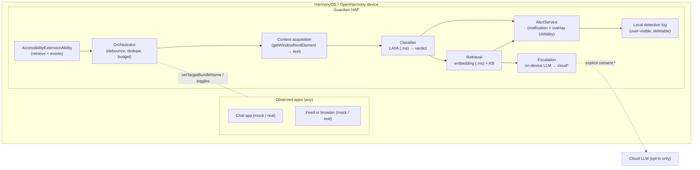

# Guardian — an on-device safety copilot for HarmonyOS / OpenHarmony

> **Status:** design (v1, for review). Working title; product name / bundle id
> are placeholders — `com.hackyeah.guardian`.
> **Date:** 2026-10-03
> **Platform:** HarmonyOS / OpenHarmony (Oniro), native **ArkTS / ArkUI**
> **API level:** minimum **API 20** (compile = compatible = 20)
> **Challenge areas:** *Human-Centric Technology* (accessibility, digital
> wellbeing) + *Intelligent Experiences* (on-device AI).

---

## 1. Overview

Guardian is a **system-wide, on-device safety copilot**. While the user is in
another app (a chat, a browser, a social feed), an accessibility service reads
the **visible UI text**, runs **local inference** to classify it, and warns the
user about **scams and misleading content** before they act.

- **One engine, multiple detectors** — scam/phishing and misinformation share a
  single acquire → classify → retrieve → respond pipeline.
- **On-device by default** — no screen content leaves the phone unless the user
  explicitly consents to a cloud escalation for a specific incident.
- **Advisory only** — Guardian never takes actions (no auto-pay, no auto-close,
  no auto-reply). It informs and suggests.

### One-line description

> An accessibility-based, on-device AI copilot that detects scam and
> misinformation content on screen and guides the user to a safe action — fully
> offline, with explicit opt-in and a consent-gated cloud fallback.

---

## 2. Personas & user stories (refined)

### Persona A — the target scam victim ("Dana", elderly, low digital literacy)

1. Dana opens a chat app. A new message from an unknown number claims to be her
   child: a car accident, a destroyed phone, an urgent transfer, and threats of
   legal consequences.
2. As the message is rendered, Guardian (running in the background) has already
   analyzed the visible text.
3. Guardian posts a **high-priority notification** ("Potential scam detected")
   and vibrates. *(On HarmonyOS with Live View support — stretch — this would be
   a Smart Island capsule instead.)*
4. Dana taps it. Guardian's overlay screen opens, **replaying the message with
   the suspicious phrases highlighted**, explaining *how the scam works*
   (impersonation + urgency + untraceable payment), and suggesting a concrete
   action: **call your child on their known number**.
5. Dana calls her child and avoids the scam.

### Persona B — the social-media user ("Sam")

1. Sam **opts in** to feed/misinformation scanning for the browser/feed app.
2. Sam scrolls a feed. A post claims a fabricated, alarming world event.
3. Guardian detects a low-credibility, high-emotion claim and posts an alert.
4. Sam taps it. The overlay summarizes *why* it looks unreliable and links to
   reputable sources, with an "ask Guardian to explain more" action.

### Scenario classification (UX levels)

| Verdict | Meaning | Response |
| --- | --- | --- |
| **CRITICAL** | High-confidence scam / active harm (money, credentials, coercion) | Immediate: high-priority notification + vibration (+ Live View capsule on supported devices). Opens the full overlay on tap. |
| **DANGEROUS** | Suspicious or misleading, lower confidence (e.g. fake news) | Quieter alert, app-scoped; visible in the detection log. |
| **SAFE** | No concern | Nothing shown (optional local log entry). |

---

## 3. Goals & non-goals

### Goals

- Detect **scam/phishing** and **misinformation** from on-screen text, on-device.
- Keep **screen content private**: local inference by default, explicit consent
  for any cloud use.
- Give **actionable, explainable** guidance, not just a label.
- Be **accessible** (large text, screen-reader friendly, simple language) for the
  primary elderly persona.
- Run on an **OpenHarmony/Oniro emulator** (CPU, no HMS) as the reproducible
  baseline, with a clear **device (Kirin NPU + HMS)** production path.

### Non-goals

- Silent screen capture / no accessibility-service bypass.
- True Smart Island / over-other-apps overlays via a normal HAP (requires system
  privileges — see §4).
- Auto-remediation (blocking, paying, replying, closing apps).
- General-purpose malware/URL reputation scanning in v1.
- Non-text content (images/video) beyond an optional OCR fallback.

---

## 4. Platform feasibility & constraints (what the OS actually allows)

Verified against the installed SDK (`~/setup-ohos-sdk/linux/23`, API 23). These
constraints drive the whole architecture.

| Capability | API | Third-party? | Notes |
| --- | --- | --- | --- |
| Read other apps' UI text | `@ohos.application.AccessibilityExtensionAbility` + `AccessibilityExtensionContext.getWindowRootElement()` | **Yes** (user enables the service in Settings) | Capabilities: `retrieve`, `gesture`, `keyEventObserver`, `zoom`, `touchGuide`. Syscap `SystemCapability.BarrierFree.Accessibility.Core`. |
| React to screen changes | `onAccessibilityEvent(event)`; `eventType` ∈ `pageActive`, `textUpdate`, `scroll`, window updates, `notificationChange` | **Yes** | Drives scanning triggers (§6). |
| Inject gestures (optional) | `AccessibilityExtensionContext.injectGesture(Sync)` | **Yes** | Not required for v1; could later power "one-tap help". |
| Open our own UI from the service | `ExtensionContext.startAbility` | **Yes** | Used to open the alert overlay screen. |
| High-priority notification + vibration | `@ohos.notificationManager` | **Yes** | The primary alert surface. |
| **Draw a window over other apps** | `window.TYPE_FLOAT` | **No** — requires `ohos.permission.SYSTEM_FLOAT_WINDOW` (system) | No accessibility-overlay window type exists. |
| **Smart Island / Live View** | `NotificationSystemLiveViewContent` | **No** — "Only system applications are supported" | Third-party path is the HMS **Live View Kit** (HarmonyOS only, API 11+), likely real-device/AGC-bound; **unverified on the emulator**. |
| On-device embeddings | `@ohos.data.intelligence` (API 15+) | Yes, **but absent on the Oniro image** | We bundle our own embedding model instead (§8). |
| On-device inference | `@kit.MindSporeLiteKit` / `@ohos.ai.mindSporeLite` | **Yes** | CPU on emulator; `NNRTDeviceType.ACCELERATOR` → Kirin NPU on device. |
| Screenshot capture | `@ohos.screenshot` | Yes, permission/foreground-gated | **Not used by default**; text comes from accessibility. Optional OCR fallback only. |

**Design consequences**

1. The product is an **accessibility service** (an `AccessibilityExtensionAbility`
   inside our installable HAP), not a privileged system service.
2. The literal "Smart Island → overlay over the chat app" UX is **out of scope
   for the shipping build**. We implement **notification → in-app overlay** and
   keep a **Live View adapter** behind an interface as a documented stretch.
3. The app must handle the **emulator's limits** (CPU-only, no NPU, no HMS,
   `data.intelligence` absent) without changing the product promise.

---

## 5. Architecture



Components:

- **AccessibilityExtensionAbility** — subscribes to accessibility events and
  reads the current window's element tree.
- **Orchestrator** — turns raw events into *scan jobs*: debounce, content-hash
  dedupe, per-app gating (`setTargetBundleName` + user toggles), and a CPU/battery
  budget (cooldown, max scans/min, skip if unchanged).
- **Content acquisition** — flattens `AccessibilityElement` text into a
  normalized string (reading order, capped length), with source metadata
  (bundle name, window, timestamp).
- **Classifier** — LAYA (converted to MindSpore Lite `.ms`) over the configured
  label space → `{ category, verdict, confidence }`.
- **Retrieval (RAG)** — embeds the text with a bundled embedding model and
  retrieves the closest scams/heuristics + remediation from the local KB.
- **Escalation** — follows the KB "system triggers" (on-device LLM, then cloud
  with consent).
- **AlertService** — posts the notification and hosts the overlay `UIAbility`.
- **Detection log** — optional, local, redacted, user-viewable and deletable.

### Data flow (single scan)

```
event → debounce/dedupe → gate by app toggle → read text tree → normalize
      → LAYA classify → verdict? → embedding retrieval → remediation
      → AlertService (notify / open overlay) → optional log
```

---

## 6. Content acquisition & triggers

**How we read content.** `AccessibilityExtensionContext.getWindowRootElement()`
returns the active window's `AccessibilityElement` tree; we traverse it and
concatenate `text`, `description`, and hint fields in reading order, capped at a
configurable length (default ~2,000 chars) to bound inference cost. Child apps
are restricted with `setTargetBundleName()` to only the apps the user enabled.

**When we scan (triggers).** Event-driven, never continuous:

- Accessibility events: `pageActive`, window content changes, `textUpdate`,
  `scroll` (post-scroll settle), `notificationChange`.
- **Debounce** (≈400–800 ms) + **content-hash dedupe** so a transcript is
  classified once, not per keystroke.
- **Privacy/energy budget**: per-app gating, a cooldown, a max-scan rate, and a
  hard skip when the extracted text is unchanged.

**Why not screenshots/OCR by default.** Accessibility text is cheaper, sharper,
and works across apps without capture permission. An OCR fallback (image-heavy
posts) is a *stretch* and only runs on explicit user request for the current
screen.

---

## 7. Detection model

- **Model:** **LAYA** (`convaiinnovations/laya`) — a small, *non-autoregressive
  decision/routing* model (see Appendix A). It is a classifier, **not** a
  generative LLM: it can output a decision/label and score, but it cannot write
  advice.
- **Label space:** `SAFE | DANGEROUS | CRITICAL`, plus a **category**
  (`scam`, `phishing`, `misinformation`, `harassment`, `none`) and a confidence.
- **Integration:** LAYA is converted to MindSpore Lite `.ms` and run via
  `@ohos.ai.mindSporeLite` on `NNRTDeviceType.CPU` (emulator) or `ACCELERATOR`
  (Kirin NPU on device).
- **Confidence → verdict mapping** (configurable):
  - `CRITICAL`: high-confidence harm with urgency/financial/credential demand.
  - `DANGEROUS`: suspicious or misleading, or CRITICAL category at lower
    confidence.
  - `SAFE`: below the alert threshold.
- **Fallback classifier (risk mitigation):** because LAYA has no turnkey
  HarmonyOS runtime or scam-specific head, the design also allows a
  **fine-tuned small text classifier** (or embeddings + logistic regression) so
  the product is not blocked if LAYA conversion/fine-tuning underperforms. The
  interface is model-agnostic: `classify(text) → Verdict`.

---

## 8. Knowledge base, embeddings & RAG

**Purpose:** explain *what* is happening and *what to do*, grounded in curated
knowledge, with an escape hatch when the KB is insufficient.

- **KB corpus (curated, shipped offline):**
  - Scam patterns: authority/relative impersonation, urgency, isolation, unusual
    payment rails (gift cards, crypto, wire), credential/link lures.
  - Misinformation heuristics: unverified claims, emotional manipulation,
    missing sourcing, known hoaxes.
  - **Remediation templates** per category (plain language, accessibility-first).
- **Embedding model:** a small sentence embedder (e.g. `all-MiniLM-L6-v2` or
  `BGE-small-en-v1.5`, ~384-dim) converted to **`.ms`** and run on-device. This
  avoids the missing `@ohos.data.intelligence` on the emulator while keeping the
  same code path on device.
- **Retrieval:** cosine similarity top-k over KB entries; the retrieved entry
  supplies the explanation + suggested action.
- **"System triggers" (escalation rules encoded alongside KB entries):**
  1. **KB hit above threshold** → answer from the KB (fast, deterministic,
     cacheable).
  2. **No confident hit, or CRITICAL with low confidence** → **on-device LLM**
     composes a short, constrained remediation.
  3. **Still unresolved and the user consents** → **cloud LLM** for that single
     incident, with redacted text.

**Escalation chain:** `KB → on-device LLM → cloud LLM (explicit consent)`.

- **On-device LLM (device path):** a quantized small model (e.g. Qwen2.5
  0.5B–1.5B `.ms`) via the MindSpore Lite LLM module; NPU on device, CPU on the
  emulator (slow → optional/off by default there).
- **Cloud (opt-in only):** never automatic. A per-incident consent sheet states
  exactly what text would be sent. Default: **off**.

---

## 9. Response & alert UX

**`AlertSurface` abstraction** so the delivery channel is swappable:

| Surface | Availability | Role |
| --- | --- | --- |
| **Notification (+ vibration)** | All targets (OpenHarmony + HarmonyOS) | **Primary v1 surface.** High priority for CRITICAL. Tapping opens the overlay. |
| **In-app overlay screen (`UIAbility`)** | All targets | Replays the flagged text **highlighted**, explains the scam/claim, and offers actions (e.g. *Call your child*, *See reliable sources*, *Dismiss*, *Report mis-detection*). This is where the "overlay on tap" experience lives. |
| **Smart Island / Live View adapter** | HarmonyOS only, **system-verified / device**, currently unverified | Documented **stretch**. Implements the same `AlertSurface` so the detection pipeline is unchanged. |

**Accessibility of the alert:** large type, high contrast, plain-language
summary, screen-reader labels, and a "read aloud" action — matching the primary
persona.

**Explainability:** every alert shows *signals* ("asks for urgent money",
"unknown sender impersonating family", "unsourced emotional claim") rather than
just a score.

---

## 10. Consent, privacy & security

### Consent model

- **Always-on scam defense** = the user **enabling the accessibility service in
  Settings** (the OS-level consent), preceded by an onboarding explainer. The
  service only reads the screen while enabled.
- **Per-app content scanning** = explicit in-app toggles (e.g. mock chat on,
  feed off). Implemented with `setTargetBundleName` + a stored allowlist.
- **Global kill switch** and a persistent status indicator.
- **Cloud escalation** = separate, per-incident, explicit consent (default off).

### Data handling

- All classification/retrieval runs **on-device**.
- Screen text is processed **in memory**; not persisted by default.
- The optional **detection log** stores redacted verdicts locally (user-viewable
  and deletable), never raw sensitive content by default.
- Cloud (if consented): send the **minimum** redacted text for one incident; no
  identifiers, no history.

### Threat model & guardrails

- **Sensitive content** is exactly what we read → offline-first, no exfiltration,
  transparent UI, no telemetry by default.
- **Prompt injection** from on-screen text into the LLM: treat all screen content
  as untrusted data; constrain the LLM to produce short remediation text only;
  never let it trigger actions.
- **False positives/negatives** are surfaced honestly; users can dismiss/correct;
  thresholds are tunable and logged.
- **Abuse/tampering**: a user can disable the service (acceptable); we do not
  attempt persistence or privilege escalation.

---

## 11. Permissions & capabilities (minimum set)

| Permission / capability | Why |
| --- | --- |
| Accessibility service (user-enabled) | Read on-screen text; observe events |
| `ohos.permission.NOTIFICATION_CONTROLLER` (or standard notification publish) | Post the alert notification |
| (optional) `ohos.permission.VIBRATE` | Haptic alert |
| (optional) `ohos.permission.READ_IMAGEVIDEO` / screenshot, **only if** the OCR fallback is used | Not required for v1 |

No `SYSTEM_FLOAT_WINDOW`, no privileged permissions in the shipping build.

---

## 12. Demo plan (reproducible on the Oniro emulator)

Because accessibility reads *other* apps, the demo ships **separate mock apps**
so the cross-app path is real:

- `com.hackyeah.mockchat` — a WeChat-like chat UI, preloaded with the
  "family emergency / wire money" scam thread.
- `com.hackyeah.mockfeed` — a social feed with a fabricated alarming post.
- `com.hackyeah.guardian` — the accessibility service + notification + overlay.

**Script:** install all three → enable Guardian's accessibility service →
open the mock chat → Guardian's notification appears and vibrates → tap → the
overlay replays and highlights the message, explains the scam, offers *Call your
child* → repeat with the mock feed for the misinformation path.

**Evidence to capture:** build logs (`BUILD SUCCESSFUL`, JDK 17 required for
API 20+), install/launch output, `hilog` of the detection pipeline
(`classify → verdict → retrieval`), screenshots of the notification and overlay,
and the detection JSON.

**Emulator caveats:** CPU-only (no NPU), no HMS Live View, `data.intelligence`
absent. NPU/Live View are documented as the device/stretch path.

---

## 13. Risks & open questions

| Risk | Impact | Mitigation |
| --- | --- | --- |
| LAYA has no turnkey HarmonyOS runtime; conversion/accuracy unproven | High | Keep model-agnostic `classify()`; fallback fine-tuned classifier / embeddings+LR; quantize for the emulator |
| LAYA size (~322–421M params, ~1.1–1.4 GB F16) on a 4 GB emulator | Medium | Q4/Q8 quantization or smaller model for the emulator baseline |
| Accessibility tree inconsistent across apps | Medium | Robust flattening, length caps, per-app adapters |
| False positives erode trust | Medium | Tunable thresholds, clear explanations, dismiss/correct |
| Live View/Smart Island unverified on emulator | Medium | Notification-first; `AlertSurface` adapter as stretch |
| Language coverage (scams arrive in the user's language) | Medium | Start language explicitly scoped; document expansion |
| Cloud privacy concerns | Medium | Off by default; per-incident consent; minimal redacted payload |

**Open questions:** final product name/bundle; v1 language(s); which embedding
model and on-device LLM; the fine-tuning dataset for LAYA; cloud provider.

---

## 14. Milestones

1. **M0 — Scaffolding:** Guardian HAP + accessibility extension registers and
   reads text; mock chat/feed HAPs install and run.
2. **M1 — Ingestion:** event triggers, debounce/dedupe, per-app gating, text
   flattening.
3. **M2 — Classification:** LAYA `.ms` on CPU (emulator) with the label space and
   verdict mapping; fallback classifier ready.
4. **M3 — KB + RAG:** embedding `.ms`, curated KB, retrieval, explanation.
5. **M4 — UX:** notification + overlay with highlighting and actions;
   accessibility polish.
6. **M5 — Escalation:** on-device LLM path; consent-gated cloud path.
7. **M6 — Demo & hardening:** evidence capture, thresholds, docs, device/NPU and
   Live View stretch.

---

## Appendix A — What LAYA is

**LAYA** (`convaiinnovations/laya`, Apache-2.0) is a **non-autoregressive
decision / routing model** — a "System 1" short-form model, not a chat LLM. It
takes an input and produces a typed decision: **`choice`** (a selected label),
**`score`** (confidence), and **`noul`** (a no-output/unable outcome). It is built
on ModernBERT-large / mmBERT-base class backbones (~322–421M parameters) and is
millisecond-scale per decision on a GPU and sub-second on CPU.

**Why it fits Guardian:** it is small, offline-friendly, and designed for exactly
the "classify / triage / route" job we need, which keeps the scam/misinformation
verdict cheap and deterministic.

**How we use it:** as the **classifier** over our label space
(`SAFE/DANGEROUS/CRITICAL` + category). Pretrained LAYA is a general decision
model, so reaching scam-specific accuracy implies **fine-tuning on a scam/
misinformation dataset** and defining the label/decision format.

**Constraints & risks:**

- **No official HarmonyOS/ArkTS runtime.** We must export/convert (ONNX →
  MindSpore Lite `.ms`). Operator/NPU support is model-dependent.
- **Memory:** F16 weights ≈ 1.1–1.4 GB peak; the Oniro emulator is 4 GB and
  CPU-only, so we plan **quantized (Q4/Q8)** weights for the emulator baseline.
- **Not generative:** LAYA cannot write remediation text — that is the job of the
  RAG KB and (when needed) the on-device/cloud LLM.

## Appendix B — References

- OpenHarmony `@ohos.application.AccessibilityExtensionAbility`,
  `AccessibilityExtensionContext`, `@ohos.accessibility` (capabilities, events).
- `@ohos.notificationManager` (`NotificationSystemLiveViewContent` — system-only)
  and `@ohos.window` (`TYPE_FLOAT` → `ohos.permission.SYSTEM_FLOAT_WINDOW`).
- `@kit.MindSporeLiteKit` / `@ohos.ai.mindSporeLite`; `@ohos.data.intelligence`.
- `convaiinnovations/laya` model card (Hugging Face).
- Repo research: `docs/ONDEVICE_AI_VALIDATION.md`, `docs/DELIVERABLES.md`.
