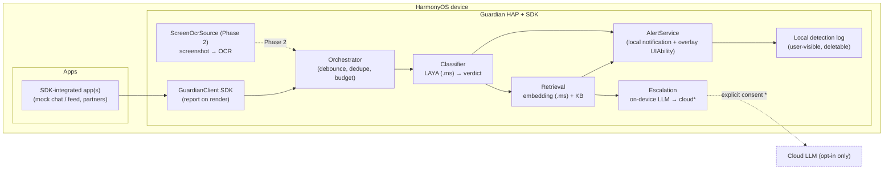

# Guardian — an on-device safety copilot for HarmonyOS

> **Status:** **Phase 1 implemented** (SDK trigger + automated tests); **Phase 2
> OCR engine implemented** (PP-OCRv4 det+rec on MindSpore Lite, demoed on the
> emulator); §16 remains design/roadmap. See **§17 As-built** for exactly what
> ships today.
> **Date:** 2026-10-03
> **Target platform:** **HarmonyOS** (Huawei), native **ArkTS / ArkUI**
> **API level:** minimum **API 20**; the current dev/CI build compiles against the
> local **OpenHarmony API 23** SDK and runs on the Oniro emulator (no HarmonyOS
> emulator is set up yet).
> **Challenge areas:** *Human-Centric Technology* (accessible, wellbeing-focused
> guidance) + *Intelligent Experiences* (on-device AI).
>
> **Scope decision (2026-10-03):** the submission targets **HarmonyOS only** and
> is **phased**:
> - **Phase 1 (hackathon — implemented):** the **in-app SDK** trigger with
>   **SDK-driven local notifications** as the alert surface. This is our
>   *simulation* of the system-app experience and runs on the emulator.
> - **Phase 2 (real, if time):** **screen capture → on-device OCR**, which reads
>   *other apps without their cooperation* — the closest a third-party HarmonyOS
>   app gets to system-level access. Requires a real device (AVScreenCapture is
>   not supported on the emulator).
> - **North star (§16):** true **first-level (system) access** (accessibility /
>   notification triggers), reachable only with system signing.
>
> The engine is identical across phases; only the `IngestSource` changes.

---

## 1. Overview

Guardian is an **on-device safety copilot**. It acquires text through the triggers
that are viable for a normal HarmonyOS app, runs **local inference** to classify
it, and warns the user about **scams and misleading content** before they act.

**Triggers, by phase (HarmonyOS, third-party):**

1. **Phase 1 — A1 in-app SDK.** Integrated apps report text on render; Guardian
   classifies on-device and raises an alert. No OS permission. Runs on the
   emulator; this is our hackathon simulation of the system-wide experience.
2. **Phase 2 — screen capture → on-device OCR (the real path).** With the user's
   consent, Guardian captures the screen (full-screen `screenshot.capture()`, or
   continuous `AVScreenCapture`) and OCRs it on-device. **This reads other apps
   without their cooperation** and is the closest third-party approximation of
   system-level access. Real device only (see §4/§5).
3. **Optional — user-initiated share / clipboard.** The user explicitly sends a
   suspicious message to Guardian.
4. **Alert surface — local notifications** (+ vibration) opening an in-app
   overlay. Notifications are the *output*, not a trigger (see §10).

**North star (§16):** with **first-level system access** (system signing),
Guardian would read the active window's text tree (accessibility) and receive
message notifications directly — the "react whenever a message is rendered in any
app" vision. Not reachable by a third-party HarmonyOS app today.

- **One engine, multiple detectors** — scam/phishing and misinformation share a
  single acquire → classify → retrieve → respond pipeline.
- **On-device by default** — no content leaves the phone unless the user
  explicitly consents to a cloud escalation for a specific incident.
- **Advisory only** — Guardian never takes actions (no auto-pay, no auto-close,
  no auto-reply). It informs and suggests.

### One-line description

> An on-device AI copilot that detects scam and misinformation content from
> messages an integrated app hands it — and, on the roadmap, from any app once it
> has system access — then guides the user to a safe action, fully offline, with
> explicit opt-in and a consent-gated cloud fallback.

---

## 2. Personas & user stories (refined)

### Persona A — the target scam victim ("Dana", elderly, low digital literacy)

1. Dana opens an **SDK-integrated** chat app. A new message from an unknown number
   claims to be her child: a car accident, a destroyed phone, an urgent transfer,
   and threats of legal consequences.
2. As the message is rendered, the app calls `GuardianClient.report(...)`, so
   Guardian analyzes the text before Dana can act.
3. Guardian posts a **local notification** ("Potential scam detected") and
   vibrates. *(On HarmonyOS with Live View support — device stretch — this could
   be a Smart Island capsule instead.)*
4. Dana taps it. Guardian's overlay screen opens, **replaying the message with
   the suspicious phrases highlighted**, explaining *how the scam works*
   (impersonation + urgency + untraceable payment), and suggesting a concrete
   action: **call your child on their known number**.
5. Dana calls her child and avoids the scam.

### Persona B — the social-media user ("Sam")

1. Sam **opts in** to feed/misinformation scanning for the browser/feed app
   (also SDK-integrated).
2. Sam scrolls a feed. A post claims a fabricated, alarming world event.
3. Guardian detects a low-credibility, high-emotion claim and posts an alert.
4. Sam taps it. The overlay summarizes *why* it looks unreliable and links to
   reputable sources, with an "ask Guardian to explain more" action.

### Scenario classification (UX levels)

| Verdict | Meaning | Response |
| --- | --- | --- |
| **CRITICAL** | High-confidence scam / active harm (money, credentials, coercion) | Immediate: high-priority notification + vibration (+ Live View capsule on supported devices). Opens the full overlay on tap. |
| **DANGEROUS** | Suspicious or misleading, lower confidence (e.g. fake news) | Quieter alert, app-scoped; visible in the detection log. |
| **SAFE** | No concern | Nothing shown (optional local log entry). |

---

## 3. Goals & non-goals

### Goals

- Detect **scam/phishing** and **misinformation** from message text, on-device.
- **Phase 1:** demonstrate end-to-end detection via the in-app SDK (no restricted
  permissions). **Phase 2:** detect **without target-app cooperation** via screen
  capture → OCR — the closest third-party approximation of system access.
- Keep **content private**: local inference by default, explicit consent for any
  cloud use.
- Give **actionable, explainable** guidance, not just a label.
- Be **accessible** (large text, screen-reader friendly, simple language) for the
  primary elderly persona.
- Run on a **HarmonyOS emulator or device** (CPU baseline; NPU on device) as the
  reproducible target.
- Keep a **clean seam** (`IngestSource`) so Phase 2 and the system-access triggers
  (§16) can be added without changing the engine.

### Non-goals (shipping build)

- **No third-party system access.** We do **not** assume system-app signing,
  the accessibility extension, or restricted permissions in the shipping build.
- **No silent screen reading.** The screen is read only on an explicit,
  user-consented capture (Phase 2).
- No drawing over other apps (`SYSTEM_FLOAT_WINDOW`), no privileged permissions.
- No auto-remediation (blocking, paying, replying, closing apps).
- General-purpose malware/URL reputation scanning is out of scope for v1.
- Non-text content (images/video) beyond the OCR path.

---

## 4. Requirements & prerequisites

Everything required to build, sign, run, and demo the **shipping** design. Missing
optional pieces degrade honestly (a source is disabled and logged) instead of
blocking the build.

### 4.1 Build toolchain

| Requirement | Value / note |
| --- | --- |
| Language / UI | ArkTS / ArkUI, stage model |
| Min API | **API 20** (HarmonyOS target); the dev/CI build currently compiles on the local **OpenHarmony API 23** SDK |
| IDE / SDK | DevEco Studio with the **HarmonyOS** SDK; the current dev/CI loop uses the OpenHarmony command-line-tools + `oniro-app` on the Oniro emulator |
| JDK | 17 (required for API 20+) |
| Node.js | ≥ 20 (Hvigor build tooling) |
| Build | `hvigorw` (DevEco) |

### 4.2 Signing & accounts (HarmonyOS)

| Requirement | Value / note |
| --- | --- |
| Debug signing | DevEco Studio **automatic signing**: a Huawei developer account with App/AppGallery admin role, the `bundleName` registered in **AppGallery Connect (AGC)**, and a connected device/emulator |
| Release signing (later) | AGC **release certificate + Profile** (`.cer` / `.p7b`), manual signing in DevEco |
| System / restricted signing | **Not required and not assumed.** No system-app signing, no ACL, no restricted permissions |

> Because the shipping build uses only normal + user-granted permissions, standard
> DevEco signing is sufficient. Restricted (`system_basic`) permissions are
> explicitly **out of scope** (§16 covers the system-access variant).

### 4.3 Runtime & device prerequisites

| Requirement | Value / note |
| --- | --- |
| Target | HarmonyOS emulator (DevEco) or a real HarmonyOS device |
| Notifications | The user must **allow notifications** for Guardian (otherwise the alert cannot be shown) |
| On-device inference | `@kit.MindSporeLiteKit` runtime available (bundled with the OS SDK) |
| Network | Not required for the core flow (offline-first); needed only for opt-in cloud escalation |

### 4.4 Assets & models

| Asset | Purpose |
| --- | --- |
| **LAYA** classifier converted to MindSpore Lite (`*.ms`), shipped in `resources/rawfile` | Verdict classification (§8) |
| Small sentence-embedder (`*.ms`) | KB retrieval / RAG (§9) |
| Curated **KB corpus** (scam patterns, misinformation heuristics, remediation templates) | Explanation + suggested actions (§9) |

### 4.5 Phase 2 prerequisites (screen capture → OCR — the real path)

| Requirement | Value / note |
| --- | --- |
| Target hardware | **Real HarmonyOS device** — `AVScreenCapture` screen recording is **not supported on the emulator** |
| Full-screen still capture | `screenshot.capture()` returns a **full-screen** screenshot; third-party access via `ohos.permission.CUSTOM_SCREEN_CAPTURE` (`normal`, `user_grant`, API 14), requested **from a foreground window** |
| Continuous capture | `AVScreenCapture` plus a **continuous task** (`ohos.permission.KEEP_BACKGROUND_RUNNING` + `backgroundModes`) so the session isn't suspended; the system shows a consent dialog + persistent capture indicator |
| On-screen trigger | Capturing while another app is foreground needs a persistent trigger (e.g. a global floating ball) or a notification action to briefly bring Guardian forward |
| OCR model | OCR model converted to `.ms` (on-device); accelerate with the NPU when present |

### 4.6 Explicitly excluded prerequisites

No system-app signing (APL `system_basic` / `ohos_system_app`), no
`ohos.permission.WRITE_ACCESSIBILITY_CONFIG`, no
`ohos.permission.ACCESSIBILITY_EXTENSION_ABILITY`, no
`ohos.permission.SUBSCRIBE_NOTIFICATION`, and no AGC restricted-permission (ACL)
approval. These belong to the intended design (§16) and are not needed to ship.

---

## 5. Platform feasibility & constraints (HarmonyOS, third-party app)

Verified against the SDK (`~/setup-ohos-sdk/linux/23`, API 23),
`toolchains/lib/PermissionDefinitions.json`, and Huawei docs. These constraints
drive the shipping architecture.

| Capability | API | Viable? | Notes |
| --- | --- | --- | --- |
| **A1 — in-app text ingress** | our `GuardianClient` (HAR) called by the host app on render | ✅ **Yes** — no OS permission | Host owns the text and reports it. Full message text, highest fidelity. **Implemented** as a common-event report (`com.hackyeah.guardian.MESSAGE_RENDERED`). **Primary trigger.** |
| **Local notification + vibration** | `@ohos.notificationManager` | ✅ Yes | The **alert surface** (SDK-driven). User must allow notifications. |
| **Phase 2 — screen capture → OCR** | `@ohos.screenshot.capture()` (full screen, `CUSTOM_SCREEN_CAPTURE`), `AVScreenCapture` (continuous) | ✅ Yes (with consent) | `CUSTOM_SCREEN_CAPTURE` = `normal` / `user_grant` (API 14), requested from a foreground window. `AVScreenCapture` needs a continuous task and is **real-device only** (no emulator). `CAPTURE_SCREEN` is system-only. |
| Manual "scan this" | `ShareExtensionAbility`, foreground `pasteboard` | ✅ Yes | User-initiated, privacy-clean. Optional. |
| On-device inference | `@kit.MindSporeLiteKit` / `@ohos.ai.mindSporeLite` | ✅ Yes | CPU on emulator; `NNRTDeviceType.ACCELERATOR` → NPU on device. |
| Remote push (Push Kit) | HMS **Push Kit** | ✅ Yes (AGC + Push capability) | Server-originated; needs network + AGC + token. **Not a trigger** for us — see §10. |
| Smart Island / Live View | HMS **Live View Kit** | ⚠️ Unverified (device/AGC-bound) | Documented **stretch** alert surface. |
| **Notification listening** (read others' notifications) | `NotificationSubscriberExtensionAbility` | ❌ **No** (for third-party) | Requires `ohos.permission.SUBSCRIBE_NOTIFICATION` = `system_basic` / provision-gated (documented for wearable/companion apps). |
| **Accessibility text-render** (any app's UI) | `AccessibilityExtensionAbility` | ❌ **No** (for third-party) | `onAccessibilityEvent/onKeyEvent` `@deprecated since API 12`; capability closed. |
| **System-app status** | APL `system_basic` / `ohos_system_app` | ❌ **No** (for third-party) | Reserved for Huawei-signed system apps. |
| **Draw a window over other apps** | `window.TYPE_FLOAT` | ❌ No | Requires `ohos.permission.SYSTEM_FLOAT_WINDOW` (system). |
| `@ohos.data.intelligence` | system on-device AI (API 15+) | ⚠️ Device-dependent | We bundle our own `.ms` models instead, so behaviour is identical everywhere. |

**Design consequences**

1. Guardian is a **normal HarmonyOS HAP plus a reusable SDK** — not a system or
   accessibility service. The detection engine is fed by an `IngestSource`
   abstraction: `InAppSdkSource` (Phase 1) and `ScreenOcrSource` (Phase 2).
2. **Phase 1** coverage is **partner/integration-driven** (a target app must call
   the SDK). **Phase 2 (OCR)** removes that requirement and reads any app on a
   real device — at a CPU/NPU and privacy cost — which is the closest a
   third-party HarmonyOS app gets to system access.
3. Alerts are delivered as **local notifications** + an in-app overlay; the
   literal "Smart Island over the chat app" UX is out of scope (Live View adapter
   is a documented device stretch).
4. The engine is **trigger-agnostic**, so Phase 2 and the system-access triggers
   in §16 plug in behind the same `IngestSource` interface.

---

## 6. Architecture



Components:

- **`GuardianClient` SDK** (`@hackyeah/guardian_sdk`, HAR) — the host app links it
  and, on rendering a message, calls
  `report({ bundleName, text, messageId?, timestampMs? })`. The report is
  serialized by `GuardianProtocol` and published as a **common event**
  (`GUARDIAN_MESSAGE_EVENT`); the SDK never reads anything the host did not hand
  it. *Design evolution:* an earlier draft used a bound `ServiceExtensionAbility`
  / typed-`Want` delivery; the common event is the simpler, permission-free
  Phase-1 mechanism, and the wire format is versioned so a service transport can
  replace it without touching the engine.
- **`ScreenOcrSource` (Phase 2)** — user-consented `screenshot.capture()` /
  `AVScreenCapture` → on-device OCR → text. Same pipeline downstream.
- **`InAppSdkSource` (Phase 1)** — subscribes to the SDK event, `decodeReport`s
  the payload, and emits a `ScanJob` to the engine.
- **Orchestrator / ingestion** — `IngestSource` turns ingress into *scan jobs*;
  `TriggerEngine` applies the scan policy (unchanged-text skip, a short dedupe
  window, a max-scans/min budget — `ScanPolicy`) and calls the classifier.
  Per-app user toggles are designed but not yet built.
- **Content normalization** — produces a normalized string (capped ≈2,000 chars)
  with source metadata (bundle, source, timestamp).
- **Classifier** — `classifyText(text) → ScanResult` behind a model-agnostic
  seam. **As built:** deterministic scam heuristics (`trigger/Classify.ts`).
  **Target:** LAYA (converted to MindSpore Lite `.ms`) over the configured label
  space → `{ category, verdict, confidence }`; the fallback classifier uses the
  same seam.
- **Retrieval (RAG)** — embeds the text with a bundled embedding model and
  retrieves the closest scams/heuristics + remediation from the local KB.
- **Escalation** — follows the KB "system triggers" (on-device LLM, then cloud
  with consent).
- **AlertService** — the `TriggerAlertSink` seam; the shipping implementation
  (`NotificationService`) posts the **local notification**. The overlay
  `UIAbility` is designed, not yet built.
- **Detection log** — optional, local, redacted, user-viewable and deletable.

### Data flow (single scan)

```
ingress (SDK report | screenshot-OCR) → debounce/dedupe
      → gate by app toggle → normalize → LAYA classify → verdict?
      → embedding retrieval → remediation → AlertService (local notification / overlay)
      → optional log
```

---

## 7. Content acquisition & triggers

Ingestion is defined by one interface — `IngestSource` — so the engine is
decoupled from *how* text arrives and the system-access triggers (§16) can be
added later.

```ts
// As implemented (platform-free; see trigger/IngestSource.ts):
interface ScanJob {
  bundleName: string;
  text: string;
  messageId?: string;
  timestampMs: number;
}

interface IngestSource {
  name: string;                     // 'sdk' now; 'screen-ocr' | 'accessibility' | 'notification' later
  enabled(): boolean;               // permission + user toggle
  start(emit: (job: ScanJob) => void): void;
  stop(): void;
}

// Where non-SAFE verdicts go (implemented by NotificationService):
interface TriggerAlertSink {
  alert(result: ScanResult, sourceText: string, source: TriggerSource): void;
}
```

### 7.1 Phase 1 — In-app SDK (primary — implemented)

The host app links `GuardianClient` (`@hackyeah/guardian_sdk`) and calls it
whenever it **renders message text** (and optionally on a suspicious action):

```ts
import { GuardianClient } from '@hackyeah/guardian_sdk';
client.report({ bundleName: 'com.hackyeah.mockchat', text: msg.text, messageId: '3', timestampMs: Date.now() });
```

`GuardianProtocol.encodeReport` serializes the report and `GuardianClient`
publishes it on the **`com.hackyeah.guardian.MESSAGE_RENDERED`** common event.
Guardian's `InAppSdkSource` subscribes, `decodeReport`s the payload (JSON, with a
plain-text fallback for legacy publishers; malformed/empty reports are dropped)
and emits a `ScanJob` to the engine. No OS permission and no hidden screen read
are involved: the host only reports text it already owns.

- **As built:** `report()` is fire-and-forget; Guardian alerts on
  `DANGEROUS`/`CRITICAL` through `TriggerAlertSink` (`NotificationService`). A
  **synchronous inline-verdict** API is designed but not yet exposed.
- **Designed, not yet built:** per-app **user toggle**.
- Because the host is the source, this is the **highest-fidelity, fully-open**
  path and the one the demo/mock apps use.

### 7.2 Phase 2 — Screen capture → OCR (the real path)

`ScreenOcrSource` reads the screen **without target-app cooperation**:

- **Still capture:** `screenshot.capture()` returns a **full-screen** image; the
  app holds `CUSTOM_SCREEN_CAPTURE` (requested from a foreground window).
- **Continuous capture:** `AVScreenCapture` + a continuous task lets Guardian
  watch a chat while it is foreground; the system shows a consent dialog and a
  persistent capture indicator. *Real device only.*
- **Triggering:** while another app is foreground, trigger via a persistent
  on-screen control (global floating ball) or a notification action.
- **Processing:** throttle frames (e.g. on foreground-app change / content
  change), crop to likely text regions, run on-device OCR, feed the pipeline.
- **Hardware:** CPU baseline; use the NPU (`NNRTDeviceType.ACCELERATOR`) when
  available.

**As built (OCR engine, 2026-10-03).** `extractTextFromImage(pixelMap, mgr)` in
`entry/src/main/ets/ocr/OcrEngine.ets` runs **PP-OCRv4 mobile** detection and
recognition converted to MindSpore Lite:
`det` (`1×960×960`, DB) finds text quads
(`DbPostprocess.ts`: components → min-area rect → rect-expansion unclip),
`rec` (`1×48×960`, SVTR/CTC) reads each crop (`ImageOps.ts`),
and `CtcDecode.ts` maps the `ppocr_keys_v1` dictionary. Models ship in
`resources/rawfile/ocr/`. On the Oniro emulator (API 23, CPU) the page
`pages/OcrDemo.ets` recognizes a bundled sample in ~3.9 s total
(models 21 ms, detect 663 ms, recognize 2346 ms for 6 lines). The
`ScreenOcrSource` wraps this for the real capture path. This is independent of
the Core Vision Kit seam in `vision/` (which is HarmonyOS-only and returns `''`
on the OpenHarmony emulator). A demo entry point is `pages/OcrDemo`.

### 7.3 Optional — user-initiated share / clipboard

A `ShareExtensionAbility` target (and a foreground clipboard read) let the user
explicitly send a suspicious message to Guardian. Privacy-clean and permission-free
when user-initiated.

### 7.4 Scan policy (applies to all sources)

- **Event-driven, never continuous.**
- **Debounce/dedupe** so a transcript is classified once, not per
  keystroke/message-fragment. **As built** (`ScanPolicy`): a hard skip when the
  text is unchanged, plus a short dedupe window, plus a rolling **max-scans/min**
  budget (clock-injectable).
- **Privacy/energy budget**: designed additions are per-app gating and a
  cooldown; the max-scan rate + unchanged-skip are implemented.

**Why SDK first.** For the hackathon it is the fastest, most accurate, and
emulator-friendly path (no restricted permission, no OCR cost), and it proves the
whole pipeline end-to-end. Its one drawback — it needs target-app cooperation — is
removed by Phase 2 (OCR), and removed entirely by the system-access triggers in
§16.

---

## 8. Detection model

- **Model:** **LAYA** (`convaiinnovations/laya`) — a small, *non-autoregressive
  decision/routing* model (see Appendix A). It is a classifier, **not** a
  generative LLM: it can output a decision/label and score, but it cannot write
  advice.
- **Label space:** `SAFE | DANGEROUS | CRITICAL`, plus a **category**
  (`scam`, `phishing`, `misinformation`, `harassment`, `none`) and a confidence.
- **Integration:** LAYA is converted to MindSpore Lite `.ms` and run via
  `@ohos.ai.mindSporeLite` on `NNRTDeviceType.CPU` (emulator) or `ACCELERATOR`
  (NPU on device).
- **Confidence → verdict mapping** (configurable):
  - `CRITICAL`: high-confidence harm with urgency/financial/credential demand.
  - `DANGEROUS`: suspicious or misleading, or CRITICAL category at lower
    confidence.
  - `SAFE`: below the alert threshold.
- **Fallback classifier (risk mitigation):** because LAYA has no turnkey
  HarmonyOS runtime or scam-specific head, the design also allows a
  **fine-tuned small text classifier** (or embeddings + logistic regression) so
  the product is not blocked if LAYA conversion/fine-tuning underperforms. The
  interface is model-agnostic: `classify(text) → Verdict`.
- **As built (Phase 1):** the classifier shipped today is a **deterministic
  rules engine** (`trigger/Classify.ts`) over the same label space
  (impersonation, urgency, unusual payment rails, isolation →
  `SAFE`/`DANGEROUS`/`CRITICAL`). LAYA drops in behind the identical
  `classifyText(text) → ScanResult` seam.

---

## 9. Knowledge base, embeddings & RAG

**Purpose:** explain *what* is happening and *what to do*, grounded in curated
knowledge, with an escape hatch when the KB is insufficient.

> **Phase-1 resource:** the shipped incident knowledge base, its LAYA matching,
> severity, and the **L0/L1/L2** message escalation are specified in **§18**. The
> embedding model and RAG below are the longer-term retrieval layer.

- **KB corpus (curated, shipped offline):**
  - Scam patterns: authority/relative impersonation, urgency, isolation, unusual
    payment rails (gift cards, crypto, wire), credential/link lures.
  - Misinformation heuristics: unverified claims, emotional manipulation,
    missing sourcing, known hoaxes.
  - **Remediation templates** per category (plain language, accessibility-first).
- **Embedding model:** a small sentence embedder (e.g. `all-MiniLM-L6-v2` or
  `BGE-small-en-v1.5`, ~384-dim) converted to **`.ms`** and run on-device. This
  keeps the same code path on every device and avoids depending on system AI.
- **Retrieval:** cosine similarity top-k over KB entries; the retrieved entry
  supplies the explanation + suggested action.
- **"System triggers" (escalation rules encoded alongside KB entries):**
  1. **KB hit above threshold** → answer from the KB (fast, deterministic,
     cacheable).
  2. **No confident hit, or CRITICAL with low confidence** → **on-device LLM**
     composes a short, constrained remediation.
  3. **Still unresolved and the user consents** → **cloud LLM** for that single
     incident, with redacted text.

**Escalation chain:** `KB → on-device LLM → cloud LLM (explicit consent)`.

- **On-device LLM (device path):** a quantized small model (e.g. Qwen2.5
  0.5B–1.5B `.ms`) via the MindSpore Lite LLM module; NPU on device, CPU on the
  emulator (slow → optional/off by default there).
- **Cloud (opt-in only):** never automatic. A per-incident consent sheet states
  exactly what text would be sent. Default: **off**.

---

## 10. Response & alert UX

**`AlertSurface` abstraction** so the delivery channel is swappable — implemented
as the `TriggerAlertSink` interface (`NotificationService` is the shipping sink):

| Surface | Availability | Role |
| --- | --- | --- |
| **Local notification (+ vibration)** | HarmonyOS (third-party) | **Primary surface.** A detection (SDK in Phase 1, OCR in Phase 2) posts a notification; tapping opens the overlay. User must allow notifications. |
| **In-app overlay screen (`UIAbility`)** | HarmonyOS | Replays the flagged text **highlighted**, explains the scam/claim, and offers actions (*Call your child*, *See reliable sources*, *Dismiss*, *Report mis-detection*). |
| **Smart Island / Live View adapter** | HarmonyOS device (HMS Live View Kit), unverified | Documented **stretch**. Same `AlertSurface`, so the pipeline is unchanged. |

**Notifications are the output, not a trigger.** Two notification mechanisms are
worth distinguishing:

- **Local notification (used):** the app composes and posts the alert itself via
  `@ohos.notificationManager.publish()` — on-device, offline, no server. This is
  what "SDK-driven notification" means: a **local** alert raised by our own
  detection pipeline (which in Phase 1 is fed by the SDK).
- **Push Kit remote push (not used):** a backend → Huawei Push servers → device.
  It requires AGC + Push capability + a token and network, and cannot read local
  messages or other apps' notifications. It is not a trigger for Guardian; it is
  only relevant if a backend ever needs to wake the app.

**Accessibility of the alert:** large type, high contrast, plain-language summary,
screen-reader labels, and a "read aloud" action — matching the primary persona.

**Explainability:** every alert shows *signals* ("asks for urgent money", "unknown
sender impersonating family", "unsourced emotional claim") rather than just a score.

---

## 11. Consent, privacy & security

### Consent model

- **A1 (SDK)** = two consents: the **host app** chooses to integrate and report
  (developer-side), and the **user** enables Guardian per app in-app. No OS-level
  screen permission is requested.
- **A3 (screen OCR)** = explicit **per-capture** consent via the system dialog;
  never background.
- **Notifications** = the user's OS-level "allow notifications" setting.
- **Global kill switch** and a persistent status indicator, showing the active
  ingress sources.
- **Cloud escalation** = separate, per-incident, explicit consent (default off).

### Data handling

- All classification/retrieval runs **on-device**.
- Messages are processed **in memory**; not persisted by default.
- The optional **detection log** stores redacted verdicts locally (user-viewable
  and deletable), never raw sensitive content by default.
- Cloud (if consented): send the **minimum** redacted text for one incident; no
  identifiers, no history.

### Threat model & guardrails

- **Sensitive content** is exactly what we ingest → offline-first, no
  exfiltration, transparent UI, no telemetry by default.
- **Prompt injection** from ingested text into the LLM: treat all message text as
  untrusted data; constrain the LLM to produce short remediation text only; never
  let it trigger actions.
- **False positives/negatives** are surfaced honestly; users can dismiss/correct;
  thresholds are tunable and logged.
- **Abuse/tampering**: a user can disable the feature (acceptable); we do not
  attempt persistence or privilege escalation.

---

## 12. Permissions & capabilities (minimum set)

| Permission / capability | Why | Build |
| --- | --- | --- |
| — (none) for A1 SDK ingress | Host app reports text it already owns | Shipping |
| Notification publish (`@ohos.notificationManager`, user-enabled) | Post the alert notification | Shipping |
| `ohos.permission.VIBRATE` (optional) | Haptic alert | Shipping |
| `ohos.permission.CUSTOM_SCREEN_CAPTURE` (`normal`, `user_grant`) + system consent dialog | Phase 2 screen capture → OCR (still capture) | **Phase 2** |
| `ohos.permission.KEEP_BACKGROUND_RUNNING` + `backgroundModes` (continuous task) | Phase 2 continuous `AVScreenCapture` (real device) | **Phase 2** |

**No system or restricted permissions** in the shipping build (no
`SYSTEM_FLOAT_WINDOW`, no accessibility extension, no `SUBSCRIBE_NOTIFICATION`, no
`system_basic`). Since all permissions are normal/user-granted, standard DevEco
signing is sufficient. Absent capabilities degrade honestly.

---

## 13. Demo plan (reproducible on a HarmonyOS emulator)

The demo ships a **separate mock app** that integrates the SDK, so the cross-app,
"message rendered → Guardian reacts" path is real in principle:

- `com.hackyeah.mockchat` — a WeChat-like chat UI, preloaded with the
  "family emergency / wire money" scam thread. It links **`GuardianClient`** and
  calls `report(...)` as each message renders. **Built.**
- `com.example.huwaweichallenge` — the Guardian engine HAP: the `InAppSdkSource`
  endpoint (subscribes to the SDK event), the notification alert, and the in-app
  `TriggerDemo` replay. **Built.**
- `com.hackyeah.mockfeed` — a social feed with a fabricated alarming post; also
  SDK-integrated. **Design only.**

**Script (A1, primary):** launch Guardian (it subscribes to the SDK event) → allow
notifications → open the mock chat → it reports the scam message → Guardian
classifies on-device → a high-priority notification appears → tap → the overlay
replays and highlights the message and offers *Call your child*.

**Emulator caveat (verified).** The Oniro emulator aggressively kills the
backgrounded Guardian process, so once the mock chat is foreground Guardian no
longer receives SDK reports there. On the emulator we therefore demonstrate the
pipeline with the **on-device `ohosTest`** suite and the in-app **`TriggerDemo`**
replay; the *live cross-app* demo needs a real HarmonyOS device or a
persistent/background mechanism (Phase 2, §7.2).

**Automated evidence (Phase 1, run on the Oniro API 23 emulator):** unit
**16/16**; hypium `ohosTest` **3/3** (`Tests run: 3, Failure: 0, Error: 0,
Pass: 3`). See §17 for the exact commands.

**Phase 2 (real, device):** no mock cooperation — Guardian captures the screen
(`screenshot.capture()` for a still, or continuous `AVScreenCapture` + a
continuous task), OCRs it on-device, and raises the same alert. Run on a **real
device** (`AVScreenCapture` is unsupported on the emulator); use the still
`screenshot.capture()` path on the emulator if it is supported there.

**Evidence to capture:** build logs (`BUILD SUCCESSFUL`, JDK 17 for API 20+),
install/launch output, `hilog` of the pipeline
(`ingest → classify → verdict → retrieval`), screenshots of the notification and
overlay, and the detection JSON.

**Emulator caveats:** CPU-only (no NPU), HMS Live View unverified; notification
permission must be enabled in Settings. NPU/Live View are documented as
device/stretch paths.

---

## 14. Risks & open questions

| Risk | Impact | Mitigation |
| --- | --- | --- |
| **Coverage needs app adoption** — a third-party HarmonyOS app cannot auto-read other apps | High | Ship a clean SDK + docs; demo via mock apps; treat §16 system access as the north star |
| LAYA has no turnkey HarmonyOS runtime; conversion/accuracy unproven | High | Model-agnostic `classify()`; fallback fine-tuned classifier / embeddings+LR; quantize for the emulator |
| LAYA size (~322–421M params, ~1.1–1.4 GB F16) on a 4 GB emulator | Medium | Q4/Q8 quantization or a smaller model for the emulator baseline |
| **AVScreenCapture is not supported on the emulator** | High (Phase 2 demo) | Demo Phase 2 on a real device; keep the Phase 1 SDK demo for the emulator |
| Background capture survival (continuous task may be killed / power-managed) | Medium | `KEEP_BACKGROUND_RUNNING` + `backgroundModes` + progress/heartbeat; test on a real device |
| Screen capture permission from background / triggering over other apps | Medium | Request `CUSTOM_SCREEN_CAPTURE` from the foreground; use a persistent on-screen trigger or a notification action |
| False positives erode trust | Medium | Tunable thresholds, clear explanations, dismiss/correct |
| Live View/Smart Island unverified | Medium | Notification-first; `AlertSurface` adapter as stretch |
| Language coverage (scams arrive in the user's language) | Medium | Scope v1 language explicitly; document expansion |
| Cloud privacy concerns | Medium | Off by default; per-incident consent; minimal redacted payload |

**Open questions:** final product name/bundle; v1 language(s); which embedding
model and on-device LLM; the fine-tuning dataset for LAYA; cloud provider.

---

## 15. Milestones

1. **M0 — Scaffolding:** ✅ Guardian HAP + `GuardianClient` SDK build and install;
   mock chat reports a message via the SDK. *(feed app not built)*
2. **M1 — Ingestion:** ✅ `IngestSource` interface; `InAppSdkSource` live;
   dedupe/budget (`ScanPolicy`). ☐ per-app gating, normalization.
3. **M2 — Classification:** ◐ deterministic rules classifier shipped behind
   `classifyText()`; ☐ LAYA `.ms` on CPU + verdict mapping.
4. **M3 — KB + RAG:** embedding `.ms`, curated KB, retrieval, explanation.
5. **M4 — UX:** SDK-driven local notification + overlay with highlighting and
   actions; accessibility polish.
6. **M5 — Escalation:** on-device LLM path; consent-gated cloud path.
7. **M6 — Demo & hardening (Phase 1):** SDK demo with mock apps, evidence
   capture, thresholds, docs, device/NPU and Live View stretch.
8. **M7 — Phase 2 (real OCR):** `ScreenOcrSource` using `screenshot.capture()`
   and/or `AVScreenCapture` + continuous task on a **real device**; throttling and
   NPU acceleration; verify **no-cooperation** detection (mock app untouched).

---

## 16. Intended / final design — first-level (system) access

> **Status:** north star / not reachable by a third-party app in any phase. It is
> retained so the seam (`IngestSource`) exists and the roadmap is explicit.

**Concept.** "First-level system access" means the app is **signed as a system
app** (APL `system_basic` / `app-feature = ohos_system_app`), which unlocks
system-wide, automatic triggers that a normal app cannot have. With it, Guardian
would stop depending on host-app integration and simply react to whatever is on
screen / in the notification stream.

**What it enables (the full vision):**

1. **Accessibility text-render trigger** — read the active window's element tree
   in *any* app and react whenever a message is rendered:
   - `AccessibilityExtensionAbility` (`onAccessibilityEvent`) +
     `AccessibilityExtensionContext.getWindowRootElement()`, capability
     `retrieve`.
   - Programmatic enablement (no Settings dance) via the system-only
     `@ohos.accessibility.config.enableAbility('<bundle>/<ability>', ['retrieve'])`,
     permission `ohos.permission.WRITE_ACCESSIBILITY_CONFIG`.
2. **Notification trigger** — `NotificationSubscriberExtensionAbility.onReceiveMessage()`
   for apps that are not integrated, permission
   `ohos.permission.SUBSCRIBE_NOTIFICATION`.

Both plug into the existing engine as additional `IngestSource`s
(`accessibility`, `notification`) — the classifier, KB/RAG, and alert UX are
unchanged.

**How the tier is reached:**

- **OpenHarmony / Oniro (reproducible today, dev only):** self-sign as a system
  app using the SDK material — `OpenHarmony.p12` (the SDK's built-in dev
  password),
  `OpenHarmonyProfileRelease.pem`, `UnsgnedReleasedProfileTemplate.json`,
  `hap-sign-tool.jar`; set `bundle-info.apl = system_basic` and
  `app-feature = ohos_system_app`, re-sign the Profile, then sign the HAP. This is
  documented and reproducible, but **debug/dev only** (not for AppGallery).
  *(The Oniro emulator's acceptance of raised-APL signing and the API-12
  deprecation of the accessibility callbacks are the open verification risks.)*
- **HarmonyOS (target platform):** the same first-level access exists but is
  reserved for **Huawei-signed system apps**; a third-party app cannot obtain it
  without Huawei system signing / approval. On HarmonyOS this section is therefore
  **aspirational** and is the reason the third-party design is phased SDK-first
  (Phase 1) then OCR (Phase 2).

**Relationship to the phased design.** One engine; the system build simply swaps
`InAppSdkSource` / `ScreenOcrSource` for `AccessibilitySource` +
`NotificationSource`. The Phase 1/2 build is the honest, publishable subset;
system access is the full target.

**Ethics/consent.** Even with system access, the accessibility service is
user-enabled and visible; Guardian remains advisory-only and on-device by default.

---

## 17. As-built (Phase 1) — what actually ships today

**Status:** implemented and tested on the dev emulator. The pieces below are in
the repo; everything else in this document is target/roadmap.

### Code map

| Area | Path |
| --- | --- |
| SDK HAR `@hackyeah/guardian_sdk` | `HuwaweiChallenge/guardian_sdk/` |
| SDK client | `guardian_sdk/src/main/ets/GuardianClient.ets` (`report()`, injectable `ReportEmitter`) |
| SDK wire contract | `guardian_sdk/src/main/ets/GuardianProtocol.ts` (`GUARDIAN_MESSAGE_EVENT`, `encodeReport`/`decodeReport`) |
| Ingestion | `entry/src/main/ets/sdk/InAppSdkSource.ets`; `entry/src/main/ets/trigger/IngestSource.ts` |
| Engine | `entry/src/main/ets/trigger/TriggerEngine.ets` |
| Scan policy | `entry/src/main/ets/trigger/ScanPolicy.ts` |
| Classifier | `entry/src/main/ets/trigger/Classify.ts` (deterministic rules) |
| Alert sink | `entry/src/main/ets/alert/NotificationService.ets` |
| Host demo | `mocks/mockchat/` (calls `GuardianClient.report`) |
| In-app replay | `entry/src/main/ets/pages/TriggerDemo.ets` |
| Incident KB (data, §18) | `entry/src/main/resources/rawfile/kb/en/incidents.json` |

### Wire format

- Event: `com.hackyeah.guardian.MESSAGE_RENDERED`
- Payload (`data`): `{"v":1,"bundleName":…,"text":…,"messageId"?…,"timestampMs"?…}`
- `decodeReport` also accepts a bare string (legacy publishers) and drops
  empty/malformed payloads.

### Tests (automatic)

| Suite | How to run | Result |
| --- | --- | --- |
| Unit (device-free, `node --test`) | `tsc -p tsconfig.tests.json && node --test .test-build/tests/unit/` | **16/16 pass** |
| Integration (hypium `ohosTest`, on-device) | build + install the app & `ohosTest` HAP, then `aa test -b com.example.huwaweichallenge -m entry_test -s unittest OpenHarmonyTestRunner` | **3/3 pass** |

The test **code** lives in `tests/unit/*.test.ts` (+ `tsconfig.tests.json`) and
`entry/src/ohosTest`; no wrapper scripts are committed (the `oniro-app`/`hdc`
commands are used directly).

Unit tests cover the SDK protocol (round-trip, plain-text fallback, rejection of
empty/malformed), classifier thresholds, and scan-policy dedupe/budget. The
integration test encodes via the SDK, decodes exactly as `InAppSdkSource` does,
and drives a real `TriggerEngine` with a fake alert sink.

### Dev environment & known limits

- **Dev/CI:** OpenHarmony **Oniro API 23** emulator, built with the
  command-line-tools via `oniro-app`; the shipping target stays **HarmonyOS
  API 20+** (a HarmonyOS dev build is not yet set up).
- **Emulator limitation (verified):** the emulator kills the backgrounded
  Guardian process, so the live cross-app path is not reproducible there (§13).
- **In repo but not shipping:** an `AccessibilityExtensionAbility` prototype
  (`entry/src/main/ets/accessibility/GuardianAccessibilityExtAbility.ets`) exists
  for OpenHarmony dev testing of the §16 tier.
- **Not yet built:** overlay `UIAbility`, the KB/RAG runtime (resource defined in
  §18), LAYA `.ms`, per-app toggles, Phase 2 OCR (§7.2), system sources (§16).

---

## 18. Knowledge resource (incidents) — schema & escalation

The on-device knowledge base ships as one locale-scoped **JSON data resource**
(no scripts, no network):

```
entry/src/main/resources/rawfile/kb/en/incidents.json
```

### 18.1 Top level

```json
{
  "schemaVersion": 1,
  "locale": "en",
  "severityColors": { "CRITICAL": "#E84026", "WARNING": "#ED6F21", "INFO": "#0A59F7" },
  "prompts": { "localSystem": "…", "cloudSystem": "…" },
  "incidents": [ /* 10 */ ]
}
```

### 18.2 Incident fields

| Field | Meaning |
| --- | --- |
| `id`, `version`, `locale` | stable key, migration, i18n |
| `category` | `scam` \| `misinformation` \| `harassment` \| `notice` |
| `severity` | `CRITICAL` \| `WARNING` \| `INFO` — **UI colour/priority only**, independent of the engine's `Verdict` |
| `escalation` | `L0` \| `L1` \| `L2` — the highest message layer this case may use |
| `cta` | label of the escalation button |
| `title` | short heading (rendered large) |
| `description` | one/two sentences — **part 1 of LAYA's label** |
| `keywords` | screen phrases that trigger the case — **part 2 of LAYA's label** |
| `signals` | deterministic pre-`classify` gate (`required` / `anyOf`) |
| `explanation`, `remediation`, `actions`, `sources` | overlay content + model grounding |
| `messages` | `level0` (always) plus `level1` and/or `level2` |

**LAY A contract.** The message text is the input; each case is a choice labelled
`description + " — " + keywords.join(", ")`; LAYA returns the best `id` (or none).
The matched case supplies `severity`, `messages`, and `remediation`. There is no
vector store in Phase 1.

### 18.3 Standard message + escalation

Every layer emits the same object — `{ "title": …, "text": … }` — and the app
attaches `severity` from the case (the model never sets it). `level0` **always**
exists and is shown immediately, offline. Escalation is **on demand**: the L0
message carries the case's `cta`, and only a tap escalates.

| Level | Field | Runs | When | Fallback |
| --- | --- | --- | --- | --- |
| **L0** | `messages.level0` | none | always (the floor) | — |
| **L1** | `messages.level1` | on-device LLM | user taps `cta` | → L0 |
| **L2** | `messages.level2` | cloud + retrieval | user taps `cta`, then consents | → L0 |

- **L0 "What should I do?"** reveals the static `explanation` / `remediation` — no model.
- **L1 "Explain this"** runs the local LLM (no consent, no network).
- **L2 "Check this claim"** needs explicit consent and a **grounded** cloud lookup
  that returns cited `sources` (never model memory); offline or declined → L0.

### 18.4 The 10 incidents

| id | sev | esc | LAYA label (`description` — `keywords`) |
| --- | --- | --- | --- |
| `family-emergency-money` *(scenario A)* | CRITICAL | L0 | Relative in trouble, urgent money, don't call — it's me, new number, phone broke, accident, send money, don't call, transfer, gift card, hospital, bail |
| `misinfo-breaking-event` *(scenario B)* | WARNING | L2 | Alarming breaking-news claim, no credible source, share quickly — breaking, confirm before deleted, sources say, share now |
| `bank-authority-impersonation` | CRITICAL | L0 | Claims to be bank/police/tax pushing verify or pay — bank fraud department, verify your account, account will be frozen, click here, police |
| `delivery-fee-smishing` | WARNING | L0 | Held parcel asks a small fee or details via a link — parcel held, delivery failed, customs fee, small fee, reschedule |
| `otp-verification-theft` | CRITICAL | L0 | Someone asks you to read out or forward a one-time code — share the code, 6-digit code, read me the code, otp |
| `gift-card-utility-threat` | CRITICAL | L0 | Threat of disconnection/fine/arrest, pay by gift card or crypto — final notice, disconnection, pay with gift cards, arrest, bitcoin |
| `investment-guaranteed-returns` | CRITICAL | L1 | Guaranteed/high returns, act fast off-platform — guaranteed returns, weekly profit, mentor, dm me, whatsapp, no risk |
| `romance-scam` | WARNING | L1 | Online partner never met, repeatedly needs money — i love you, never met, clearance fee, send money, visa |
| `sextortion-blackmail` | CRITICAL | L0 | Threat to expose private images/info unless you pay — i have your video, webcam, pay in bitcoin, your contacts |
| `safe-otp-notice` | INFO | L0 | A legitimate one-time code with no related request — verification code, one-time password, do not share this code |

7 cases are fully offline (L0), 2 use the on-device LLM (L1), 1 uses the cloud
with consent (L2).

### 18.5 Caveats

- Misinformation is `WARNING` ("may be unreliable") and **never** asserts falsehood.
- L2 sends only the claim text (§11) and caches results by claim hash.
- The resource is validated by `tests/unit/kb-incidents.test.ts` (schema, enums,
  layer/level consistency).

---

## Appendix A — What LAYA is

**LAYA** (`convaiinnovations/laya`, Apache-2.0) is a **non-autoregressive
decision / routing model** — a "System 1" short-form model, not a chat LLM. It
takes an input and produces a typed decision: **`choice`** (a selected label),
**`score`** (confidence), and **`noul`** (a no-output/unable outcome). It is built
on ModernBERT-large / mmBERT-base class backbones (~322–421M parameters) and is
millisecond-scale per decision on a GPU and sub-second on CPU.

**Why it fits Guardian:** it is small, offline-friendly, and designed for exactly
the "classify / triage / route" job we need, which keeps the scam/misinformation
verdict cheap and deterministic.

**How we use it:** as the **classifier** over our label space
(`SAFE/DANGEROUS/CRITICAL` + category). Pretrained LAYA is a general decision
model, so reaching scam-specific accuracy implies **fine-tuning on a scam/
misinformation dataset** and defining the label/decision format.

**Constraints & risks:**

- **No official HarmonyOS/ArkTS runtime.** We must export/convert (ONNX →
  MindSpore Lite `.ms`). Operator/NPU support is model-dependent.
- **Memory:** F16 weights ≈ 1.1–1.4 GB peak; the emulator is 4 GB and CPU-only, so
  we plan **quantized (Q4/Q8)** weights for the emulator baseline.
- **Not generative:** LAYA cannot write remediation text — that is the job of the
  RAG KB and (when needed) the on-device/cloud LLM.

## Appendix B — References

- Shipping trigger + alert: our `GuardianClient` SDK; `@ohos.notificationManager`
  local notifications; `@ohos.screenshot` (`CUSTOM_SCREEN_CAPTURE` =
  `normal`/`user_grant`) and AVScreenCapture (Phase 2).
- Excluded for third-party HarmonyOS: `@ohos.application.AccessibilityExtensionAbility`
  (`@deprecated since 12`; `ACCESSIBILITY_EXTENSION_ABILITY` = `system_basic`),
  `@ohos.application.NotificationSubscriberExtensionAbility`
  (`SUBSCRIBE_NOTIFICATION` = `system_basic`), `window.TYPE_FLOAT`
  (`SYSTEM_FLOAT_WINDOW` = system), `NotificationSystemLiveViewContent`
  (system-only; third-party path is HMS Live View Kit).
- Intended/final design (§16): `@ohos.accessibility.config.enableAbility`
  (`WRITE_ACCESSIBILITY_CONFIG` = `system_basic`, ACL-disabled) +
  `AccessibilityExtensionContext.getWindowRootElement()`; permissive APL/system
  signing for OpenHarmony (`toolchains/lib/UnsgnedReleasedProfileTemplate.json`,
  `OpenHarmony.p12`, `hap-sign-tool.jar`).
- Runtime/AI: `@kit.MindSporeLiteKit` / `@ohos.ai.mindSporeLite`;
  `convaiinnovations/laya` model card (Hugging Face).
- Research log: `AI_WORKFLOW_s3r10us3r.md`; repo research:
  `docs/ONDEVICE_AI_VALIDATION.md`, `docs/DELIVERABLES.md`.
